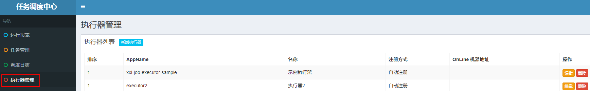
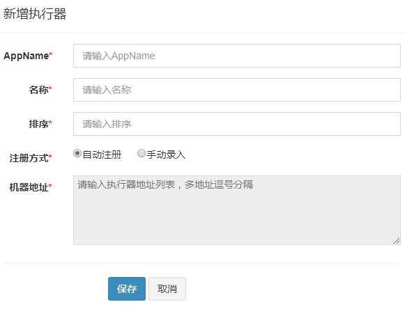
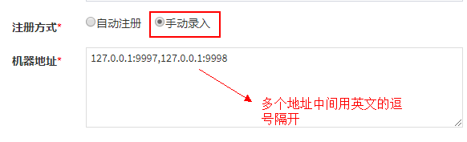
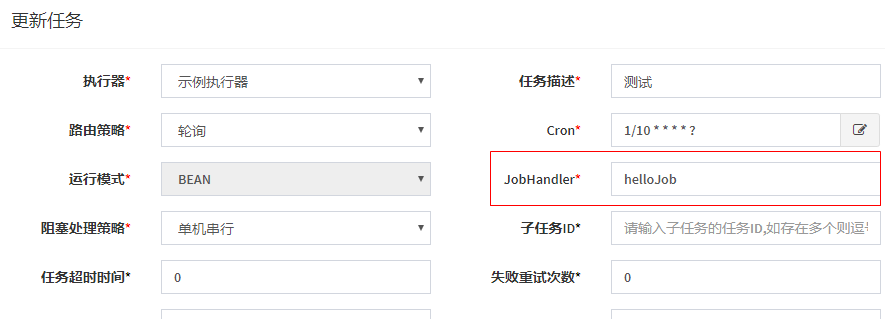
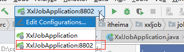
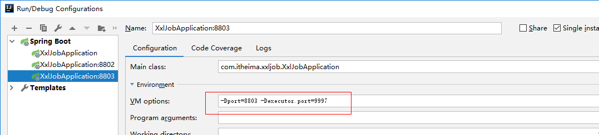

# 01-今日学习目标 01:06

- 能够理解什么是分布式任务调度
- 能够掌握xxl-job的基本使用
- 能够使用xxl-job解决黑马头条项目中定时任务的功能
- 能够完成自媒体文章人工审核功能
- 能够完成自媒体端文章上下架同步的问题


# 02-什么是任务调度 06:34

我们可以先思考一下业务场景的解决方案：

- 某电商系统需要在每天上午10点，下午3点，晚上8点发放一批优惠券。
- 某银行系统需要在信用卡到期还款日的前三天进行短信提醒。
- 某财务系统需要在每天凌晨0:10结算前一天的财务数据，统计汇总。
- 12306会根据车次的不同，设置某几个时间点进行分批放票。

以上业务场景的解决方案就是任务调度。

**任务调度是指系统为了自动完成特定任务，在约定的特定时刻去执行任务的过程。有了任务调度即可解放更多的人力，而是由系统自动去执行任务。**

如何实现任务调度？

- 多线程方式，结合sleep
- JDK提供的API，例如：Timer、ScheduledExecutor
- 框架，例如Quartz ，它是一个功能强大的任务调度框架，可以满足更多更复杂的调度需求
- spring task

**入门案例**

spring框架中默认就支持了一个任务调度，spring-task

（1）创建一个工程：spring-task-demo

pom文件

```xml
<!-- 继承Spring boot工程 -->
<parent>
    <groupId>org.springframework.boot</groupId>
    <artifactId>spring-boot-starter-parent</artifactId>
    <version>2.1.5.RELEASE</version>
</parent>

<dependencies>
    <dependency>
        <groupId>org.springframework.boot</groupId>
        <artifactId>spring-boot-starter-web</artifactId>
    </dependency>
</dependencies>
```

（2）引导类：

```java
package com.itheima.task;

import org.springframework.boot.SpringApplication;
import org.springframework.boot.autoconfigure.SpringBootApplication;
import org.springframework.scheduling.annotation.EnableScheduling;

@SpringBootApplication
@EnableScheduling
public class TaskApplication {

    public static void main(String[] args) {
        SpringApplication.run(TaskApplication.class,args);
    }
}
```

(3)编写案例

```java
package com.itheima.task.job;

import org.springframework.scheduling.annotation.Scheduled;
import org.springframework.stereotype.Component;

import java.util.Date;

@Component
public class HelloJob {

    @Scheduled(cron = "0/5 * * * * ?")
    public void eat(){
        System.out.println("5秒中吃一次饭，我想成为一个胖子"+new Date());
    }
}
```

测试：启动项目，每隔5秒中会执行一次eat方法


# 03-cron表达式 08:03

```
0  0 14  ？ 5   1#2   *
秒 分 时 天 月 星期 年
```


cron表达式是一个字符串, 用来设置定时规则, 由七部分组成, 每部分中间用空格隔开, 每部分的含义如下表所示:

| **组成部分** |     **含义**      |       **取值范围**        |
| :----------: | :---------------: | :-----------------------: |
|   第一部分   |   Seconds (秒)    |           0－59           |
|   第二部分   |    Minutes(分)    |           0－59           |
|   第三部分   |     Hours(时)     |           0-23            |
|   第四部分   | Day-of-Month(天)  |           1-31            |
|   第五部分   |     Month(月)     |       0-11或JAN-DEC       |
|   第六部分   | Day-of-Week(星期) | 1-7(1表示星期日)或SUN-SAT |
|   第七部分   |   Year(年) 可选   |         1970-2099         |

另外, cron表达式还可以包含一些特殊符号来设置更加灵活的定时规则, 如下表所示:

| **符号** | **含义**                                                     |
| :------: | :----------------------------------------------------------- |
|    ?     | 表示不确定的值。当两个子表达式其中一个被指定了值以后，为了避免冲突，需要将另外一个的值设为“?”。例如：想在每月20日触发调度，不管20号是星期几，只能用如下写法：0 0 0 20 * ?，其中最后以为只能用“?” |
|    *     | 代表所有可能的值                                             |
|    ,     | 设置多个值,例如”26,29,33”表示在26分,29分和33分各自运行一次任务 |
|    -     | 设置取值范围,例如”5-20”，表示从5分到20分钟每分钟运行一次任务 |
|    /     | 设置频率或间隔,如"1/15"表示从1分开始,每隔15分钟运行一次任务  |
|    L     | 用于每月，或每周，表示每月的最后一天，或每个月的最后星期几,例如"6L"表示"每月的最后一个星期五" |
|    W     | 表示离给定日期最近的工作日,例如"15W"放在每月（day-of-month）上表示"离本月15日最近的工作日" |
|    #     | 表示该月第几个周X。例如”6#3”表示该月第3个周五                |

为了让大家更熟悉cron表达式的用法, 接下来我们给大家列举了一些例子, 如下表所示:

| **cron表达式**     | **含义**                                |
| ------------------ | --------------------------------------- |
| */5 * * * * ?      | 每隔5秒运行一次任务                     |
| 0 0 23 * * ?       | 每天23点运行一次任务                    |
| 0 0 1 1 * ?        | 每月1号凌晨1点运行一次任务              |
| 0 0 23 L * ?       | 每月最后一天23点运行一次任务            |
| 0 26,29,33 * * * ? | 在26分、29分、33分运行一次任务          |
| 0 0/30 9-17 * * ?  | 朝九晚五工作时间内每半小时运行一次任务  |
| 0 15 10 ? * 6#3    | 每月的第三个星期五上午10:15运行一次任务 |

```
0  0  21  ？ 5  1#2  *
秒 分 时 日 月 周 年

0/30
```


# 04-什么是分布式任务调度 04:11

当前软件的架构已经开始向分布式架构转变，将单体结构拆分为若干服务，服务之间通过网络交互来完成业务处理。在分布式架构下，一个服务往往会部署多个实例来运行我们的业务，如果在这种分布式系统环境下运行任务调度，我们称之为**分布式任务调度**。


将任务调度程序分布式构建，这样就可以具有分布式系统的特点，并且提高任务的调度处理能力：

1、并行任务调度

并行任务调度实现靠多线程，如果有大量任务需要调度，此时光靠多线程就会有瓶颈了，因为一台计算机CPU的处理能力是有限的。

如果将任务调度程序分布式部署，每个结点还可以部署为集群，这样就可以让多台计算机共同去完成任务调度，我们可以将任务分割为若干个分片，由不同的实例并行执行，来提高任务调度的处理效率。

2、高可用

若某一个实例宕机，不影响其他实例来执行任务。

3、弹性扩容

当集群中增加实例就可以提高并执行任务的处理效率。

4、任务管理与监测

对系统中存在的所有定时任务进行统一的管理及监测。让开发人员及运维人员能够时刻了解任务执行情况，从而做出快速的应急处理响应。

**分布式任务调度面临的问题：**

当任务调度以集群方式部署，同一个任务调度可能会执行多次，例如：电商系统定期发放优惠券，就可能重复发放优惠券，对公司造成损失，信用卡还款提醒就会重复执行多次，给用户造成烦恼，所以我们需要控制相同的任务在多个运行实例上只执行一次。常见解决方案：

- 分布式锁，多个实例在任务执行前首先需要获取锁，如果获取失败那么就证明有其他服务已经在运行，如果获取成功那么证明没有服务在运行定时任务，那么就可以执行。
- ZooKeeper选举，利用ZooKeeper对Leader实例执行定时任务，执行定时任务的时候判断自己是否是Leader，如果不是则不执行，如果是则执行业务逻辑，这样也能达到目的。


# 05-XXL-Job简介 04:54

针对分布式任务调度的需求，市场上出现了很多的产品：

1） TBSchedule：淘宝推出的一款非常优秀的高性能分布式调度框架，目前被应用于阿里、京东、支付宝、国美等很多互联网企业的流程调度系统中。但是已经多年未更新，文档缺失严重，缺少维护。

2） XXL-Job：大众点评的分布式任务调度平台，是一个轻量级分布式任务调度平台, 其核心设计目标是开发迅速、学习简单、轻量级、易扩展。现已开放源代码并接入多家公司线上产品线，开箱即用。

3）Elastic-job：当当网借鉴TBSchedule并基于quartz 二次开发的弹性分布式任务调度系统，功能丰富强大，采用zookeeper实现分布式协调，具有任务高可用以及分片功能。

4）Saturn： 唯品会开源的一个分布式任务调度平台，基于Elastic-job，可以全域统一配置，统一监
控，具有任务高可用以及分片功能。 

XXL-JOB是一个分布式任务调度平台，其核心设计目标是开发迅速、学习简单、轻量级、易扩展。现已开放源代码并接入多家公司线上产品线，开箱即用。

源码地址：https://gitee.com/xuxueli0323/xxl-job

文档地址：https://www.xuxueli.com/xxl-job/

**特性**

- **简单灵活**
  提供Web页面对任务进行管理，管理系统支持用户管理、权限控制；
  支持容器部署；
  支持通过通用HTTP提供跨平台任务调度；
- **丰富的任务管理功能**
  支持页面对任务CRUD操作；
  支持在页面编写脚本任务、命令行任务、Java代码任务并执行；
  支持任务级联编排，父任务执行结束后触发子任务执行；
  支 持设置指定任务执行节点路由策略，包括轮询、随机、广播、故障转移、忙碌转移等；
  支持Cron方式、任务依赖、调度中心API接口方式触发任务执行
- **高性能**
  任务调度流程全异步化设计实现，如异步调度、异步运行、异步回调等，有效对密集调度进行流量削峰；
- **高可用**
  任务调度中心、任务执行节点均 集群部署，支持动态扩展、故障转移
  支持任务配置路由故障转移策略，执行器节点不可用是自动转移到其他节点执行
  支持任务超时控制、失败重试配置
  支持任务处理阻塞策略：调度当任务执行节点忙碌时来不及执行任务的处理策略，包括：串行、抛弃、覆盖策略
- **易于监控运维**
  支持设置任务失败邮件告警，预留接口支持短信、钉钉告警；
  支持实时查看任务执行运行数据统计图表、任务进度监控数据、任务完整执行日志；


# 06-入门案例环境搭建 10:42

在分布式架构下，通过XXL-Job实现定时任务


调度中心：负责管理调度信息，按照调度配置发出调度请求，自身不承担业务代码。

任务执行器：负责接收调度请求并执行任务逻辑。

任务：专注于任务的处理。

调度中心会发出调度请求，任务执行器接收到请求之后会去执行任务，任务则专注于任务业务的处理。


>目前官方已经更新版本为2.2.0不再是snapshot，我已经将版本更新

1.在SQLyog中执行xxl-job资料中的tables_xxl_job.sql

2.编辑资料中的application.properties，修改mysql路径和用户名密码

3.使用cmd,cd到jar包所在目录，执行

>java -jar xxl-job-admin-2.2.0.jar
>
>或者
>
>xxljob.bat

访问http://localhost:10086/xxl-job-admin即可

默认登录账号：admin/123456

# 09-创建执行器和任务 07:29

### 配置执行器

在任务调度中心，点击进入"执行器管理"界面, 如下图:


1、此处的AppName,会在创建任务时被选择，每个任务必然要选择一个执行器。
2、"执行器列表" 中显示在线的执行器列表, 支持编辑删除。

 以下是执行器的属性说明：

| 属性名称 | 说明                                                         |
| -------- | ------------------------------------------------------------ |
| AppName  | 是每个执行器集群的唯一标示AppName, 执行器会周期性以AppName为对象进行自动注册。可通过该配置自动发现注册成功的执行器, 供任务调度时使用; |
| 名称     | 执行器的名称, 因为AppName限制字母数字等组成,可读性不强, 名称为了提高执行器的可读性; |
| 排序     | 执行器的排序, 系统中需要执行器的地方,如任务新增, 将会按照该排序读取可用的执行器列表; |
| 注册方式 | 调度中心获取执行器地址的方式；                               |
| 机器地址 | 注册方式为"手动录入"时有效，支持人工维护执行器的地址信息；   |

**具体操作：**

（1）新增执行器：



（2）自动注册和手动注册的区别和配置



### 在调度中心新建任务

在任务管理->新建，填写以下内容


- 执行器：任务的绑定的执行器，任务触发调度时将会自动发现注册成功的执行器, 实现任务自动发现功能; 另一方面也可以方便的进行任务分组。每个任务必须绑定一个执行器, 可在 "执行器管理" 进行设置

- 任务描述：任务的描述信息，便于任务管理

  路由策略：当执行器集群部署时，提供丰富的路由策略，包括

  - FIRST（第一个）：固定选择第一个机器；

  - LAST（最后一个）：固定选择最后一个机器；

  - ROUND（轮询）：

  - RANDOM（随机）：随机选择在线的机器；

  - CONSISTENT_HASH（一致性HASH）：每个任务按照Hash算法固定选择某一台机器，且所有任务均匀散列在不同机器上。

  - LEAST_FREQUENTLY_USED（最不经常使用）：使用频率最低的机器优先被选举；

  - LEAST_RECENTLY_USED（最近最久未使用）：最久为使用的机器优先被选举；

  - FAILOVER（故障转移）：按照顺序依次进行心跳检测，第一个心跳检测成功的机器选定为目标执行器并发起调度；

  - BUSYOVER（忙碌转移）：按照顺序依次进行空闲检测，第一个空闲检测成功的机器选定为目标执行器并发起调度；

  - SHARDING_BROADCAST(分片广播)：广播触发对应集群中所有机器执行一次任务，同时系统自动传递分片参数；可根据分片参数开发分片任务；

- Cron：触发任务执行的Cron表达式；

- 运行模式：

  - BEAN模式：任务以JobHandler方式维护在执行器端；需要结合 "JobHandler" 属性匹配执行器中任务；

  - GLUE模式(Java)：任务以源码方式维护在调度中心；该模式的任务实际上是一段继承自IJobHandler的Java类代码并 "groovy" 源码方式维护，它在执行器项目中运行，可使用@Resource/@Autowire注入执行器里中的其他服务；

  - GLUE模式(Shell)：任务以源码方式维护在调度中心；该模式的任务实际上是一段 "shell" 脚本；

  - GLUE模式(Python)：任务以源码方式维护在调度中心；该模式的任务实际上是一段 "python" 脚本；

  - GLUE模式(PHP)：任务以源码方式维护在调度中心；该模式的任务实际上是一段 "php" 脚本；

  - GLUE模式(NodeJS)：任务以源码方式维护在调度中心；该模式的任务实际上是一段 "nodejs" 脚本；

  - GLUE模式(PowerShell)：任务以源码方式维护在调度中心；该模式的任务实际上是一段 "PowerShell" 脚本；

- JobHandler：运行模式为 "BEAN模式" 时生效，对应执行器中新开发的JobHandler类“@JobHandler”注解自定义的value值；

- 阻塞处理策略：调度过于密集执行器来不及处理时的处理策略；

  - 单机串行（默认）：调度请求进入单机执行器后，调度请求进入FIFO队列并以串行方式运行；

  - 丢弃后续调度：调度请求进入单机执行器后，发现执行器存在运行的调度任务，本次请求将会被丢弃并标记为失败；

  - 覆盖之前调度：调度请求进入单机执行器后，发现执行器存在运行的调度任务，将会终止运行中的调度任务并清空队列，然后运行本地调度任务；

- 子任务：每个任务都拥有一个唯一的任务ID(任务ID可以从任务列表获取)，当本任务执行结束并且执行成功时，将会触发子任务ID所对应的任务的一次主动调度。

- 任务超时时间：支持自定义任务超时时间，任务运行超时将会主动中断任务；

- 失败重试次数；支持自定义任务失败重试次数，当任务失败时将会按照预设的失败重试次数主动进行重试；

- 报警邮件：任务调度失败时邮件通知的邮箱地址，支持配置多邮箱地址，配置多个邮箱地址时用逗号分隔；

- 负责人：任务的负责人；

- 执行参数：任务执行所需的参数；


# 10-与Spring Boot集成 10:18

新建项目：xxl-job-demo

（1）pom文件

```xml
<groupId>com.itheima</groupId>
<artifactId>xxl-job-demo</artifactId>
<version>1.0-SNAPSHOT</version>
<!-- 继承Spring boot工程 -->
<parent>
    <groupId>org.springframework.boot</groupId>
    <artifactId>spring-boot-starter-parent</artifactId>
    <version>2.1.5.RELEASE</version>
</parent>

<dependencies>
    <dependency>
        <groupId>org.springframework.boot</groupId>
        <artifactId>spring-boot-starter-web</artifactId>
    </dependency>
    <!-- xxl-job -->
    <dependency>
        <groupId>com.xuxueli</groupId>
        <artifactId>xxl-job-core</artifactId>
        <version>2.2.0</version>
    </dependency>
</dependencies>

<build>
    <plugins>
        <plugin>
            <groupId>org.springframework.boot</groupId>
            <artifactId>spring-boot-maven-plugin</artifactId>
        </plugin>
    </plugins>
</build>
```

>2.2.0-snapshot版本已经不存在，改成2.2.0版本

(2)配置有两个，一个是application.properties，另外一个是日志配置:logback.xml

application.properties

```properties
# web port
server.port=${port:8801}
# no web
#spring.main.web-environment=false

# log config
logging.config=classpath:logback.xml


### xxl-job admin address list, such as "http://address" or "http://address01,http://address02"
xxl.job.admin.addresses=http://localhost:8888/xxl-job-admin

### xxl-job, access token
xxl.job.accessToken=

### xxl-job executor appname
xxl.job.executor.appname=xxl-job-executor-sample
### xxl-job executor registry-address: default use address to registry , otherwise use ip:port if address is null
xxl.job.executor.address=
### xxl-job executor server-info
xxl.job.executor.ip=
xxl.job.executor.port=${executor.port:9999}
### xxl-job executor log-path
xxl.job.executor.logpath=/data/applogs/xxl-job/jobhandler
### xxl-job executor log-retention-days
xxl.job.executor.logretentiondays=30

```

logback.xml

```xml
<?xml version="1.0" encoding="UTF-8"?>
<configuration debug="false" scan="true" scanPeriod="1 seconds">

    <contextName>logback</contextName>
    <property name="log.path" value="/data/applogs/xxl-job/xxl-job-executor-sample-springboot.log"/>

    <appender name="console" class="ch.qos.logback.core.ConsoleAppender">
        <encoder>
            <pattern>%d{HH:mm:ss.SSS} %contextName [%thread] %-5level %logger{36} - %msg%n</pattern>
        </encoder>
    </appender>

    <appender name="file" class="ch.qos.logback.core.rolling.RollingFileAppender">
        <file>${log.path}</file>
        <rollingPolicy class="ch.qos.logback.core.rolling.TimeBasedRollingPolicy">
            <fileNamePattern>${log.path}.%d{yyyy-MM-dd}.zip</fileNamePattern>
        </rollingPolicy>
        <encoder>
            <pattern>%date %level [%thread] %logger{36} [%file : %line] %msg%n
            </pattern>
        </encoder>
    </appender>

    <root level="info">
        <appender-ref ref="console"/>
        <appender-ref ref="file"/>
    </root>

</configuration>
```

(3)引导类：

```java
package com.itheima.xxljob;

import org.springframework.boot.SpringApplication;
import org.springframework.boot.autoconfigure.SpringBootApplication;

@SpringBootApplication
public class XxlJobApplication {

    public static void main(String[] args) {
        SpringApplication.run(XxlJobApplication.class,args);
    }
}
```

### 2.2.4 添加xxl-job配置

添加配置类：

这个类主要是创建了任务执行器，参考官方案例编写，无须改动

```java
package com.itheima.xxljob.config;

import com.xxl.job.core.executor.impl.XxlJobSpringExecutor;
import org.slf4j.Logger;
import org.slf4j.LoggerFactory;
import org.springframework.beans.factory.annotation.Value;
import org.springframework.context.annotation.Bean;
import org.springframework.context.annotation.Configuration;

/**
 * xxl-job config
 *
 * @author xuxueli 2017-04-28
 */
@Configuration
public class XxlJobConfig {
    private Logger logger = LoggerFactory.getLogger(XxlJobConfig.class);

    @Value("${xxl.job.admin.addresses}")
    private String adminAddresses;

    @Value("${xxl.job.accessToken}")
    private String accessToken;

    @Value("${xxl.job.executor.appname}")
    private String appName;

    @Value("${xxl.job.executor.address}")
    private String address;

    @Value("${xxl.job.executor.ip}")
    private String ip;

    @Value("${xxl.job.executor.port}")
    private int port;

    @Value("${xxl.job.executor.logpath}")
    private String logPath;

    @Value("${xxl.job.executor.logretentiondays}")
    private int logRetentionDays;


    @Bean
    public XxlJobSpringExecutor xxlJobExecutor() {
        logger.info(">>>>>>>>>>> xxl-job config init.");
        XxlJobSpringExecutor xxlJobSpringExecutor = new XxlJobSpringExecutor();
        xxlJobSpringExecutor.setAdminAddresses(adminAddresses);
        xxlJobSpringExecutor.setAppname(appName);
        xxlJobSpringExecutor.setAddress(address);
        xxlJobSpringExecutor.setIp(ip);
        xxlJobSpringExecutor.setPort(port);
        xxlJobSpringExecutor.setAccessToken(accessToken);
        xxlJobSpringExecutor.setLogPath(logPath);
        xxlJobSpringExecutor.setLogRetentionDays(logRetentionDays);

        return xxlJobSpringExecutor;
    }

    /**
     * 针对多网卡、容器内部署等情况，可借助 "spring-cloud-commons" 提供的 "InetUtils" 组件灵活定制注册IP；
     *
     *      1、引入依赖：
     *          <dependency>
     *             <groupId>org.springframework.cloud</groupId>
     *             <artifactId>spring-cloud-commons</artifactId>
     *             <version>${version}</version>
     *         </dependency>
     *
     *      2、配置文件，或者容器启动变量
     *          spring.cloud.inetutils.preferred-networks: 'xxx.xxx.xxx.'
     *
     *      3、获取IP
     *          String ip_ = inetUtils.findFirstNonLoopbackHostInfo().getIpAddress();
     */


}
```

### 2.2.5 创建任务

```java
package com.itheima.xxljob.job;

import com.xxl.job.core.biz.model.ReturnT;
import com.xxl.job.core.handler.annotation.XxlJob;
import org.springframework.beans.factory.annotation.Value;
import org.springframework.stereotype.Component;

import java.time.LocalDateTime;


@Component
public class HelloJob {

    @Value("${server.port}")
    private String appPort;

    @XxlJob("helloJob")
    public ReturnT<String> hello(String param) throws Exception {
        System.out.println("helloJob："+ LocalDateTime.now()+",端口号"+appPort);
        return ReturnT.SUCCESS;
    }
}

```

<font color='red'>`@XxlJob("helloJob")`这个一定要与调度中心新建任务的JobHandler的值保持一致,如下图：</font>




# 11-测试 07:15

（1）首先启动调度中心

（2）启动xxl-job-demo项目，为了展示更好的效果，可以同时启动三个项目，用同一个JobHandler，查看处理方式。

在启动多个项目的时候，端口需要切换，连接xxl-job的执行器端口不同相同

服务一：默认启动8801端口，执行器端口为9999

idea中不用其他配置，直接启动项目即可

服务二：项目端口：8802，执行器端口：9998

idea配置如下：

- 编辑配置，Edit Configurations...


- 选中XxlJobApplication，点击复制


- 修改参数


- 启动：选中8802启动项目



服务三：项目端口：8803，执行器端口：9997




（3）测试效果

三个项目启动后，可以查看到是轮询的方式分别去执行当前调度任务。


# 12-定时扫描待发布文章-数据准备 10:18

- 前期回顾：在自媒体文章审核的时候，审核通过后，判断了文章的发布时间大于当前时间，这个时候并没有真正的发布文章，而是把文章的状态设置为了8（审核通过待发布）
- 定时任务的作用就是每分钟去扫描这些待发布的文章，如果当前文章的状态为8，并且发布时间小于当前时间的，立刻发布当前文章


自动审核的代码都是通过自媒体文章的id进行审核的，这个时候需要在admin端远程调用自媒体端查询文章状态为8且发布时间小于当前时间的文章id列表

（1）修改WmNewsControllerApi接口，新增方法

```java
/**
     * 查询需要发布的文章id列表
     * @return
     */
List<Integer> findRelease();
```

(2)业务层

在自媒体微服务中的WmNewsService新增方法

```java
/**
     * 查询需要发布的文章id列表
     * @return
     */
List<Integer> findRelease();
```

实现方法：

```java

/**
     * 查询需要发布的文章id列表
     * @return
     */
@Override
public List<Integer> findRelease(){
        List<WmNews> list = list(Wrappers.<WmNews>lambdaQuery().eq(WmNews::getStatus, 8).lt(WmNews::getPublishTime,new Date()));
        List<Integer> resultList = list.stream().map(WmNews::getId).collect(Collectors.toList());
        return resultList;
    }
```

(3)控制器

WmNewsController中新增方法

```java

@GetMapping("/findRelease")
@Override
public List<Integer> findRelease() {
    return wmNewsService.findRelease();
}
```

（4）在admin端添加远程调用feign接口

修改WemediaFeign接口添加方法

```java

@GetMapping("/api/v1/news/findRelease")
List<Integer> findRelease();
```


# 13-创建任务 12:44

讲义中的setAppName修改为setAppname


# 14-测试 03:39

cron表达式编写有误

```
0 0/1 * * * ?
```

从0分开始，每隔1分钟执行一次


# 15-人工审核文章 需求说明 03:34

平台管理员可以查看待人工审核的文章信息，可以**通过（状态改为4）**或**驳回（状态改为2）**

也可以通过点击**查看**按钮，查看文章详细信息，查看详情后可以根据内容判断是否需要通过审核


# 16-接口定义及mapper 13:51

1 需要分页查询自媒体文章信息，可以根据标题模糊查询

2 需要根据文章id查看文章的详情

3 修改文章的状态，已实现


# 17-业务层实现及测试 12:24

```java
@Autowired
private WmNewsMapper wmNewsMapper;

public PageResponseResult findListAndPage(NewsAuthDto dto){
    //1.检查参数
    dto.checkParam();
    //设置起始页
    dto.setPage((dto.getPage()-1)*dto.getSize());
    //dto.setTitle("%"+dto.getTitle()+"%");
    //需要判断是否为空,在SQL中使用concat拼接也可以  null -> "%null%"
    if(StringUtils.isNotBlank(dto.getTitle())){
       dto.setTitle("%"+dto.getTitle()+"%");
    }
    
    //2.分页查询
    List<WmNews> list = wmNewsMapper.findListAndPage(dto);
    //统计多少条数据
    int count = wmNewsMapper.findListCount(dto);
    
    //3.结果返回
    PageResponseResult responseResult = new PageResponseResult(dto.getPage(),dto.getSize(),count);
    responseResult.setData(list);
    return responseResult;
}

@Autowired
private WmUserMapper wmUserMapper;

@Override
public WmNewsVo findWmNewsVo(Integer id) {
    //1.查询文章信息
    WmNews wmNews = getById(id);
    //2.查询作者
    WmUser wmUser = null;
    if(wmNews!=null && wmNews.getUserId() != null){
        wmUser = wmUserMapper.selectById(wmNews.getUserId());
    }

    //3.封装vo信息返回
    WmNewsVo wmNewsVo = new WmNewsVo();
    BeanUtils.copyProperties(wmNews,wmNewsVo);
    if(wmUser != null){
        wmNewsVo.setAuthorName(wmUser.getName());
    }
    return wmNewsVo;
}
```


## 扩展：mybatis-plus使用mapper映射文件如何实现更优雅的分页？

```java
@Override
public PageResponseResult findList(NewsAuthDto dto) {
    //1.检查分页参数
    dto.checkParam();

    //2.设置分页条件
    dto.setPage((dto.getPage()-1)*dto.getSize());
    if(StringUtils.isNotBlank(dto.getTitle())){
        dto.setTitle("%"+dto.getTitle()+"%");
    }

    //3.分页查询
    //List<WmNewsVo> list = wmNewsMapper.findListAndPage(dto);
    IPage<WmNewsVo> wmNewsVoIPage =
            wmNewsMapper.selectPageVo(new Page<>(dto.getPage(), dto.getSize()), dto);
    //统计数据
    //int count = wmNewsMapper.findListCount(dto);

    //4.结果返回
    PageResponseResult pageResponseResult = new PageResponseResult(dto.getPage(),dto.getSize()
            ,Integer.parseInt(String.valueOf(wmNewsVoIPage.getTotal())));
    pageResponseResult.setData(wmNewsVoIPage.getRecords());
    return pageResponseResult;
}
```

mapper:

```java
/**
 * <p>
 * 查询 : 根据state状态查询用户列表，分页显示
 * </p>
 *
 * @param page 分页对象,xml中可以从里面进行取值,传递参数 Page 即自动分页,必须放在第一位(你可以继承Page实现自己的分页对象)
 * @return 分页对象
 */
public IPage<WmNewsVo> selectPageVo(Page<?> page, @Param("dto") NewsAuthDto dto);
```

```xml
<select id="selectPageVo" parameterType="com.heima.model.admin.dtos.NewsAuthDto" resultType="com.heima.model.wemedia.vo.WmNewsVo">
    SELECT
    wn.*, wu.`name` authorName
    FROM
    wm_news wn
    LEFT JOIN wm_user wu ON wn.user_id = wu.id
    <where>
        <if test="dto.title != null and dto.title != ''">
            and wn.title like #{dto.title}
        </if>
    </where>
</select>
```


# 18-admin接口定义 04:25

1 需要分页查询自媒体文章信息，可以根据标题模糊查询

2 当审核通过后，修改文章状态为4

3 当审核驳回后，修改文章状态为2(讲义中为3，错误)，并且需要说明原因

4 需要根据文章id查看文章的详情


```java
package com.heima.apis.admin;

import com.heima.model.admin.dtos.NewsAuthDto;
import com.heima.model.common.dtos.ResponseResult;

public interface NewsAuthControllerApi {

    /**
     * 查询自媒体文章列表
     * @param dto
     * @return
     */
    public ResponseResult findNews(NewsAuthDto dto);

    /**
     * 查询文章详情
     * @param id
     * @return
     */
    public ResponseResult findOne(Integer id);

    /**
     * 文章审核成功
     * @param dto
     * @return
     */
    public ResponseResult authPass(NewsAuthDto dto);

    /**
     * 文章审核失败
     * @param dto
     * @return
     */
    public ResponseResult authFail(NewsAuthDto dto);
}
```


# 19-admin业务实现 13:05

```java
@Override
public PageResponseResult findNews(NewsAuthDto dto) {
    //分页查询
    PageResponseResult responseResult = wemediaFeign.findList(dto);
    //返回的数据中有图片需要显示，需要回显一个fasfdfs服务器的地址
    responseResult.setHost(fileServerUrl);
    return responseResult;
}

@Override
public ResponseResult findOne(Integer id) {
    //1.参数检查
    if(id == null){
        return ResponseResult.errorResult(AppHttpCodeEnum.PARAM_INVALID);
    }
    //2.查询数据
    WmNewsVo wmNewsVo = wemediaFeign.findWmNewsVo(id);

    //3.结果封装
    ResponseResult responseResult = ResponseResult.okResult(wmNewsVo);
    responseResult.setHost(fileServerUrl);
    return responseResult;
}

@Override
public ResponseResult updateStatus(NewsAuthDto dto, Integer type) {
    //1.参数检查
    if(dto == null || dto.getId() == null){
        return ResponseResult.errorResult(AppHttpCodeEnum.PARAM_INVALID);
    }
    //2.查询文章信息
    WmNews wmNews = wemediaFeign.findById(dto.getId());
    if(wmNews == null){
        return ResponseResult.errorResult(AppHttpCodeEnum.DATA_NOT_EXIST);
    }
    //3.审核失败
    if(type.equals(0)){
        updateWmNews(wmNews,(short)2,dto.getMsg());
    }else if (type.equals(1)){
        //4.审核成功
        updateWmNews(wmNews,(short)4,"人工审核通过");
    }


    return ResponseResult.okResult(AppHttpCodeEnum.SUCCESS);
}
```


bug解决：

人工审核之后，无法将文章进行发布

```java
package com.heima.admin.service.impl;

import com.alibaba.fastjson.JSONArray;
import com.heima.admin.feign.ArticleFeign;
import com.heima.admin.feign.WemediaFeign;
import com.heima.admin.mapper.AdChannelMapper;
import com.heima.admin.mapper.AdSensitiveMapper;
import com.heima.admin.service.WemediaNewsAutoScanService;
import com.heima.common.aliyun.GreeTextScan;
import com.heima.common.aliyun.GreenImageScan;
import com.heima.common.fastdfs.FastDFSClient;
import com.heima.model.admin.dtos.NewsAuthDto;
import com.heima.model.admin.pojos.AdChannel;
import com.heima.model.article.pojos.ApArticle;
import com.heima.model.article.pojos.ApArticleConfig;
import com.heima.model.article.pojos.ApArticleContent;
import com.heima.model.article.pojos.ApAuthor;
import com.heima.model.common.dtos.PageResponseResult;
import com.heima.model.common.dtos.ResponseResult;
import com.heima.model.common.enums.AppHttpCodeEnum;
import com.heima.model.wemedia.pojos.WmNews;
import com.heima.model.wemedia.pojos.WmUser;
import com.heima.model.wemedia.vo.WmNewsVo;
import com.heima.utils.common.SensitiveWordUtil;
import io.seata.spring.annotation.GlobalTransactional;
import lombok.extern.log4j.Log4j2;
import org.springframework.beans.factory.annotation.Autowired;
import org.springframework.beans.factory.annotation.Value;
import org.springframework.stereotype.Service;

import java.util.*;

@Service
@Log4j2
public class WemediaNewsAutoScanServiceImpl implements WemediaNewsAutoScanService {

    @Autowired
    private WemediaFeign wemediaFeign;

    @GlobalTransactional
    //@Override
    public void autoScanByMediaNewsId(Integer id) {
        if (id == null) {
            log.error("当前的审核id空");
            return;
        }
        //1.根据id查询自媒体文章信息
        WmNews wmNews = wemediaFeign.findById(id);
        if (wmNews == null) {
            log.error("审核的自媒体文章不存在，自媒体的id:{}", id);
            return;
        }

        //2.文章状态为4（人工审核通过）直接保存数据和创建索引
        if (wmNews.getStatus() == 4) {

            if(wmNews.getPublishTime().getTime() <= System.currentTimeMillis()){
                //已经到了发布时间
                //保存数据
                saveAppArticle(wmNews);
            }else{
                updateWmNews(wmNews, (short) 8,"");
            }

            return;
        }

        //3.文章状态为8 发布时间小于等于当前时间 直接保存数据
        if (wmNews.getStatus() == 8 && wmNews.getPublishTime().getTime() <= System.currentTimeMillis()) {
            //保存数据
            saveAppArticle(wmNews);
            return;
        }

        //4.文章状态为1，待审核
        if (wmNews.getStatus() == 1) {
            //抽取文章内容中的纯文本和图片
            Map<String, Object> contentAndImagesResult = handleTextAndImages(wmNews);
            //4.1 文本审核
            boolean textScanBoolean = handleTextScan((String) contentAndImagesResult.get("content"), wmNews);
            if (!textScanBoolean) return;
            //4.2 图片审核
            boolean imagesScanBoolean = handleImagesScan((List<String>) contentAndImagesResult.get("images"), wmNews);
            if (!imagesScanBoolean) return;
            //4.3 自管理的敏感词审核
            boolean sensitiveScanBoolean = handleSensitive((String) contentAndImagesResult.get("content"), wmNews);
            if (!sensitiveScanBoolean) return;
            //4.4 发布时间大于当前时间，
            if (wmNews.getPublishTime().getTime() > System.currentTimeMillis()) {
                //修改文章状态为8
                updateWmNews(wmNews, (short) 8, "审核通过，待发布");
                return;
            }
            //5.审核通过，修改自媒体文章状态为9  保存app端相关文章信息
            saveAppArticle(wmNews);

        }


    }

    @Autowired
    private AdSensitiveMapper adSensitiveMapper;


    /**
     * 敏感词审核
     *
     * @param content
     * @param wmNews
     * @param wmNews
     * @return
     */

    private boolean handleSensitive(String content, WmNews wmNews) {

        boolean flag = true;

        List<String> allSensitive = adSensitiveMapper.findAllSensitive();
        //初始化敏感词
        SensitiveWordUtil.initMap(allSensitive);
        //文章内容自管理敏感词过滤
        Map<String, Integer> resultMap = SensitiveWordUtil.matchWords(content);
        if (resultMap.size() > 0) {
            log.error("敏感词过滤没有通过，包含了敏感词:{}", resultMap);
            //找到了敏感词，审核不通过
            updateWmNews(wmNews, (short) 2, "文章中包含了敏感词");
            flag = false;
        }

        return flag;
    }

    @Autowired
    private GreenImageScan greenImageScan;

    @Autowired
    private FastDFSClient fastDFSClient;

    @Value("${fdfs.url}")
    private String fileServerUrl;


    /**
     * 审核图片
     *
     * @param images
     * @param wmNews
     * @param wmNews
     * @return
     */

    private boolean handleImagesScan(List<String> images, WmNews wmNews) {
        if (images == null) {
            return true;
        }

        boolean flag = true;

        List<byte[]> imageList = new ArrayList<>();

        try {
            for (String image : images) {
                String imageName = image.replace(fileServerUrl, "");
                int index = imageName.indexOf("/");
                String groupName = imageName.substring(0, index);
                String imagePath = imageName.substring(index + 1);
                byte[] imageByte = fastDFSClient.download(groupName, imagePath);
                imageList.add(imageByte);
            }
            //阿里云图片审核
            Map map = greenImageScan.imageScan(imageList);
            //审核不通过
            if (!map.get("suggestion").equals("pass")) {
                //审核失败
                if (map.get("suggestion").equals("block")) {
                    //修改自媒体文章的状态，并告知审核失败原因
                    updateWmNews(wmNews, (short) 2, "文章中图片有违规");
                    flag = false;
                }

                //人工审核
                if (map.get("suggestion").equals("review")) {
                    //修改自媒体文章的状态，并告知审核失败原因
                    updateWmNews(wmNews, (short) 3, "文章图片有不确定元素");
                    flag = false;
                }
            }
        } catch (Exception e) {
            e.printStackTrace();
            flag = false;
        }
        return flag;

    }


    @Autowired
    private GreeTextScan greeTextScan;


    /**
     * 文本审核
     *
     * @param content
     * @param wmNews
     * @return
     */

    private boolean handleTextScan(String content, WmNews wmNews) {
        boolean flag = true;
        try {
            Map map = greeTextScan.greeTextScan(content);
            //审核不通过
            if (!map.get("suggestion").equals("pass")) {
                //审核失败
                if (map.get("suggestion").equals("block")) {
                    //修改自媒体文章的状态，并告知审核失败原因
                    updateWmNews(wmNews, (short) 2, "文章内容中有敏感词汇");
                    flag = false;
                }

                //人工审核
                if (map.get("suggestion").equals("review")) {
                    //修改自媒体文章的状态，并告知审核失败原因
                    updateWmNews(wmNews, (short) 3, "文章内容中有不确定词汇");
                    flag = false;
                }
            }
        } catch (Exception e) {
            e.printStackTrace();
            flag = false;
        }

        return flag;
    }


    /**
     * 修改自媒体文章
     *
     * @param wmNews
     * @param status
     * @param msg
     */

    private void updateWmNews(WmNews wmNews, short status, String msg) {
        wmNews.setStatus(status);
        wmNews.setReason(msg);
        wemediaFeign.updateWmNews(wmNews);
    }


    /**
     * 提取文本内容和图片
     *
     * @param wmNews
     * @return
     */

    private Map<String, Object> handleTextAndImages(WmNews wmNews) {

        //文章的内容
        String content = wmNews.getContent();

        //存储纯文本内容
        StringBuilder sb = new StringBuilder();
        //存储图片
        List<String> images = new ArrayList<>();

        List<Map> contentList = JSONArray.parseArray(content, Map.class);
        for (Map map : contentList) {
            if (map.get("type").equals("text")) {
                sb.append(map.get("value"));
            }

            if (map.get("type").equals("image")) {
                images.add((String) map.get("value"));
            }
        }

        if (wmNews.getImages() != null && wmNews.getType() != 0) {
            String[] split = wmNews.getImages().split(",");
            images.addAll(Arrays.asList(split));
        }

        Map<String, Object> resultMap = new HashMap<>();
        resultMap.put("content", sb.toString());
        resultMap.put("images", images);
        return resultMap;

    }

    @Autowired
    ArticleFeign articleFeign;


    /**
     * 保存app文章相关的数据
     *
     * @param wmNews
     */

    private void saveAppArticle(WmNews wmNews) {
        //保存app文章
        ApArticle apArticle = saveArticle(wmNews);
        //保存app文章配置
        saveArticleConfig(apArticle);
        //保存app文章内容
        saveArticleContent(apArticle, wmNews);

        //修改自媒体文章的状态为9
        wmNews.setArticleId(apArticle.getId());
        updateWmNews(wmNews, (short) 9, "审核通过");

        //TODO es索引创建

    }


    /**
     * 创建app端文章内容信息
     *
     * @param apArticle
     * @param wmNews
     */

    private void saveArticleContent(ApArticle apArticle, WmNews wmNews) {
        ApArticleContent apArticleContent = new ApArticleContent();
        apArticleContent.setArticleId(apArticle.getId());
        apArticleContent.setContent(wmNews.getContent());
        articleFeign.saveArticleContent(apArticleContent);
    }


    /**
     * 创建app端文章配置信息
     *
     * @param apArticle
     */

    private void saveArticleConfig(ApArticle apArticle) {
        ApArticleConfig apArticleConfig = new ApArticleConfig();
        apArticleConfig.setArticleId(apArticle.getId());
        apArticleConfig.setIsForward(true);
        apArticleConfig.setIsDelete(false);
        apArticleConfig.setIsDown(true);
        apArticleConfig.setIsComment(true);

        articleFeign.saveArticleConfig(apArticleConfig);
    }

    @Autowired
    AdChannelMapper adChannelMapper;


    /**
     * 保存文章
     *
     * @param wmNews
     * @return
     */

    private ApArticle saveArticle(WmNews wmNews) {
        ApArticle apArticle = new ApArticle();
        apArticle.setTitle(wmNews.getTitle());
        apArticle.setLayout(wmNews.getType());
        apArticle.setImages(wmNews.getImages());
        apArticle.setCreatedTime(new Date());

        //获取作者相关信息
        Integer wmUserId = wmNews.getUserId();
        WmUser wmUser = wemediaFeign.findWmUserById(wmUserId);
        if (wmUser != null) {
            String wmUserName = wmUser.getName();
            ApAuthor apAuthor = articleFeign.selectAuthorByName(wmUserName);
            if (apAuthor != null) {
                apArticle.setAuthorId(apAuthor.getId().longValue());
                apArticle.setAuthorName(apAuthor.getName());
            }

        }

        //获取频道相关信息
        Integer channelId = wmNews.getChannelId();
        AdChannel channel = adChannelMapper.selectById(channelId);
        if (channel != null) {
            apArticle.setChannelId(channel.getId());
            apArticle.setChannelName(channel.getName());
        }

        return articleFeign.saveAparticle(apArticle);
    }

    @Override
    public PageResponseResult findNews(NewsAuthDto dto) {
        //分页查询
        PageResponseResult responseResult = wemediaFeign.findList(dto);
        //返回的数据中有图片需要显示，需要回显一个fasfdfs服务器的地址
        responseResult.setHost(fileServerUrl);
        return responseResult;
    }

    @Override
    public ResponseResult findOne(Integer id) {
        //1.参数检查
        if(id == null){
            return ResponseResult.errorResult(AppHttpCodeEnum.PARAM_INVALID);
        }
        //2.查询数据
        WmNewsVo wmNewsVo = wemediaFeign.findWmNewsVo(id);

        //3.结果封装
        ResponseResult responseResult = ResponseResult.okResult(wmNewsVo);
        responseResult.setHost(fileServerUrl);
        return responseResult;
    }

    @Override
    public ResponseResult updateStatus(NewsAuthDto dto, Integer type) {
        //1.参数检查
        if(dto == null || dto.getId() == null){
            return ResponseResult.errorResult(AppHttpCodeEnum.PARAM_INVALID);
        }
        //2.查询文章信息
        WmNews wmNews = wemediaFeign.findById(dto.getId());
        if(wmNews == null){
            return ResponseResult.errorResult(AppHttpCodeEnum.DATA_NOT_EXIST);
        }
        //3.审核失败
        if(type.equals(0)){
            updateWmNews(wmNews,(short)2,dto.getMsg());
        }else if (type.equals(1)){
            //4.审核成功
            updateWmNews(wmNews,(short)4,"人工审核通过");
            //人工审核通过之后，再次执行自动审核代码
            autoScanByMediaNewsId(dto.getId());
        }


        return ResponseResult.okResult(AppHttpCodeEnum.SUCCESS);
    }
}


```


# 20-综合测试 02:44

# 21-文章上下架 05:31

在自媒体文章管理中有文章上下架的操作，上下架是文章已经审核通过发布之后的文章，目前自动审核文章和人工审核文章都已完成，可以把之前代码补充，使用异步的方式，修改app端文章的**配置信息**即可。

![1599398923029](data:image/jpg;base64,iVBORw0KGgoAAAANSUhEUgAAA2AAAAFjCAYAAABbmWgjAAAgAElEQVR4nO3dq3Ly3v+38Yvv/A6FIBiOIBwBYFBYXJBgcJV1GCLBYVEYiPlbOAIGQXIkj+ERgZZu6OZum264XjOduW82IZAE8s5a67NKh8PhgCRJkiTpy/333SsgSZIkSdfCACZJkiRJBTGASZIkSVJBDGCSJEmSVBADmCRJkiQVxAAmSZIkSQUxgEmSJElSQQxgkiRJklQQA5gkSZIkFcQAJkmSJEkFMYBJkiRJUkEMYJIkSZJUEAOYJEmSJBXEACZJkiRJBTGASZIkSVJBDGCSJEmSVBADmCRJkiQVxAAmSZIkSQUxgEmSJElSQQxgkiRJklQQA5gkSZIkFcQAJkmSJEkFMYBJkiRJUkEMYJIkSZJUEAOYJEmSJBXEACZJkiRJBTGASZIkSVJBDGCSJEmSVBADmCRJkiQVxAAmSZIkSQUxgEmSJElSQQxgkiRJklQQA5gkSZIkFcQAJkmSJEkFMYBJkiRJUkEMYJIkSZJUEAOYJEmSJBXEACZJkiRJBTGASZIkSVJBDGCSJEmSVBADmCRJkiQVxAAmSZIkSQX533evgCRJknSuVCp99yrojQ6Hw3evwq9jALvAA//3+P4DPyGO91QqfRqNjywnI8vyf5XL5Xc+NSP7l+dJkvRDeO71O51vt+8/J/sd7IJ4plQq3f3p9/gJ2203GNBs9kiytzw6I0mSu7B1rwzLLkHQJc4ysix75jEXlrjsEgQBveR96y1J0nf77t9wfR635dsYwHBn+UuK25YJvXqPXnxMSGFIGLUJlnVKpTr1XsLl7FQm2C/oduv0koQkSUjukluH8bhDhSXdbpfu6IVEdQppZCzpMB6PGTbgFPDeFgYlSfoeL/1mHw4H/37J33u3raB0uOK2wpd2jCv+WH6db9mOWUw9GMA4ZV0ZUWpOiVYHJg1Iej0WVGlP+rzUIzGJY/ZUaLX2dIMBRCtuqnv2wA6oAq1+n4udCo/rsLm7IYSz/53WR5Kkn+a5327PvX63l8K0HrraAOaB//cUeuAnPUrNLeN0TWtZJ89iM1ppSrrfs9jN2W6B2g3rN6SgLElIAfa3NAcQjTu0+y8HuNPYM3YVWkNIl3l4Yz5nsIFxuqbvkDBJ0g/jOdjf5vZ93VV2QXTH+JsuNYV/RRN4stgCMO/WCQYbYMMg6NJdLFhQoT2cMVuvn4avJKbXq9M77x+YxXRvb9kTADWiqEa1Aot6nXq9x0vDunaDAYNpk6B7y2IHlUqL1k3ts9+uJEmf4vFv8kvd2PQ7PbdN7Y740NVVQXzuwNffctqm59u6VCp94rbO2FMjiqA9rLIY1YA2k0mD+0qG5ee7Djb6TAKod7vUFzfctAF21DYbBs0ACAlD8tYzgFr7xVaw6njMmAqtVgCkLJdLFnPycWS2fkmSfhDPwa7L4XD4wnOx3+2quiB64F+fL9/mSY96c0st6lCtwm4+YLqBcJyyfq3/XxbT6+6o3rRhv4djkErTFNiz2EOVCv3+pQiW0Cs1mQKEIVGtQ7vdgv2SPVB5tQujJEnFsVz5dXK7P3V1LWAn7gDX4fHVl8+VES+2EEK13aLfgHi3I6pVGb5h8FWWQrVTpdKARXPAFBgMAELC6NiNsFp5YQF78oaykBDYbudMp4PjnRGr/gfemiRJn8guaAJbwU6uJoB54As++cBPRsynGwhh0AyYhyEAndnkcuXCOxnLPUCFBrA43RyGhLUanXaV3WJ36YWJewt2QC2KYJrHsFpnxmyWPyJNU4IM3rAikiQVyhPw6/K1F8N/p6sswuGBf12+ZnsnxAuojVes1wdWUchms4HazdsqDyYjBoMBu0reSbA6HjMepxzWa9aTCf1Gi2q1SvW552Z75tMp0y1U221mhzWzDkwHAaMUyuXzecacDEyS9L3sgqbz7W4Yu5IA5oGvzz7wk96CHVXa/bzwBtXjLFzT5iuTMGckcUyvCVEU0T4O0trtdlxq73qyhOWcDSHj2YQKe5ZxAv01aZoyDMqQZdAactOBaTOg91IZRUmSJBXqKgKY9KmSmAXQHvZpZAlxb8SCG2aHY0vYtElQqtOLk2NFxHNlGi3Yhlu2HCscZnu20ymnwodZlpFl6YVQljDa1YiiDq0yNBotmN/S7cVQLlMuAyzpBl32rTWHg5MxS79fQhInPGzQzvLvig8sNXv6BfWeZx+/q/5hGf/6PEn6Iwxg0nskMb3FjvZwCMseve4ChkMm/QZloDFZs4oANkwHTYKgRKkePzxJKvdZn88Rlj6MWeUyLLtNptMp0ycJrMFkMmEy6R+Hd5Xpr2d0mN+FvmS5AzbMl57gSH9DwH5+y233fF7AlFG3S/fFFvdzGXGvR693/D7KYrpBQOnVJvKMJHn+YhLLLkHQJc5OYext7yZbdgkCW+evhb2QdGI3xHt/vgiHB75OzgeB/nMxjkafYZCQLpfQmjB5ptJgY3IgHeZnIuXyGwaENSasD5OzG8r01ymVJIXgLc1XZfqTNa1hwqh7S3OzyW+eL8n6fetwSH9BrUaNKsHdDQ2GnT1L9qQ03n+cpzs2QNR+7TumTLAf0b29pXZzQxuAgEajDHQYj6HCkm53DrWbp5PPn5xa68qwpMN43KGVdwEgOX7XNfyyknQl/vw8YAYwnXN/kPQbJXHMHmj980WVjLg3YkeV4aQPccySt88XmL9+hVZrTzcYQLTiprpnD+yA6mvrlsXUgwGbuxtCOPtftLK79F/l767OuT/k/nwLmCRJv9+O3Q529RLTzdN7wyiiVm0z7D9sDcviHt35ls5pjor8VpYAVAiyhGS54Ha+BTrcrJ8PZI27oNZgtqqQAuznDAYQjTtUXguG5Qqd8ZjOrkJrCOlyz54OzOcMNlANXnqyJP0tBjBJkn6iLCFeLpjPp5x6FhOGRBFsp1BbrRnuY0a7HdV2mwrAk/n/qnQ6VSpl2J9uSkYMBlPgfvL3aDxj2C8/fGoS01vMoT1jcuofmMV0b+d0bmZUqBFF+Xzxi3qdW2rcrCcXW9R2g+OE89uQqNah3W4R3OwYNLcXniFJf5MBTJKkn6jcoNUKaLWGpMsle3ZUKlX2izlbNkybJaZAGIZAFdoVXm9I2jFabAnDiJv1hCCuEww2UHlm3vZGn0kA9W6X+uKGm3b+/Npmw6AZACFhCNtTfqq1X+zOWB2PGVOh1QqAlOVyyWIO43GHiuO/JF0RA5gkST/UqZBPypz5AAjh5uaGG25pTjfvHDu1ZTvdsAHCqAMZpMdpLYaXKmCU+6zXfchiet0d1Zs21XH1LkilaQrsWewvTBx/5q4FbH7fAlbpnLXMSdKVMIBJkvRjZSS9Ls0phGGH2Tofa5XsF4RhjWqQkSUp6X7BYgdUh0z652EqHztGsmO+3bAhJFrNGJKSpj0WQLXaerWwR5ZCtVOl0oBF8xikjt0Xw6iWP6haeWEB++NchyEhsN3OmU4HxzsjVs9UlJWkv8oAJknSD5QlPbq3W6h1iKI52+2cUX3OdrO5qx+4CabkOSgiqlVpV86HgWUs51OmGwgZU6tF1GpVho0yZVKW9S3TDYzTV+MXyz1AhQawON0choS1Gp12ld3i6bTxuYS4t2AH1KIIpnkMq3VmnOqCpGlK8GTsmiT9XQYwSZJ+oHJjwvrYvTCJoVqFSqvFMB3RbW6prda0Fz1ut1woflGmvz6QNy5lxL0d5zFpt9mQl4N/xbFoR7Q6AMlxLFeL/l1LW0Z8qR9htmc+nbIJI8Y3bYaTCcR1gkEAlTQv7rE8zTN2VuxDkv6w/757BaTfLyPLMrLs/c9LkoQkefcTn1/aP63Dh17xU9f/fS+dkCQJn/rKWb4dpZ8sKJdJ91CLalTpcbvdUusM3zSX17mkt2Ab5kU05qP4wrGUkcQxvSZEUcRpzubd7mGQe0m2nLMhZDybUGHPMk6gvyZNU4ZBGbIMWkNuOjBtBvSSd74RSfqFDGDSJ1h2A4KgTvyu8/eUxWLBYpF+1koQBCXqvR5xkn1uOHnWx9Y/iWPi+P7EL4vrlEr1N56A7bltNgl6CQ+DYEYW96jX37KcjLjXo9fL1yFbdgkCTwD1s2RJQpLE7HfHsVxAoz9h2IZ5c8pms2E6HxG/eiEkPYamCiR5cOvcrFnPOjAd0O09d0GjTKMF23DLlmOFw2zPdjrlVPgwv/CTXghlCaNjkY9WGRqNFsxv6fZiKJfJ64ss6QZd9q01h4OTMUu6DgYw6cPKVGohYVh7XynlbA/bLVv2JElM3Ivzk5n8zmOoeMdaVE4D4avsbrt0e5euap+vw6n1Ljm+XpyHknqdeql+DDIXlvKh9c/Yz+fM5zsex7c3Tch6nNR1XA2AMiyaNJsB9d6I0XzL5i0Tu2ZL5tst22MBgnQHYXh/lV/6CcqNBizmDKZTpltIs4RevU5wCzfpgcPhQHoD89su9VeP+S3b6S3dW+jM1vQbQLnPbBzC9pZu/ZmLN+U+6/Wa9SkZpQ9jVrkMy26T6XTK9EkCazCZTJhMTpM0l+mvZ3SYE5Tq9OKEZLkDNsyXtj5Luh6lw+Fw+O6V+EqlUunu33/8reoNvmp/SHp5NbH25PIkpOeyJGa5mDOYbp65NyQMN2w2EI5T1v03prqkR6k5JVqlDIOUdLlnT4VKv/FgnbK4x+h4olSttqlUYHF7y5YaN7MJbxmC8fH1T+j1FkCbyfHELv8MqwzvTtZefLPE8R6O41CSOGYPtPp9OL6/17ZF0jsfO3Ncn0cV5LIsy6/Uv7o+0tdKkgT2e6i0CBr/uk8euyl/+j6dkSQpBI03fX8AZFnCqHvL9DTDdDgmXb/l2Ndv43mYzrk/5CzCIRUqI4lHebno7XEC1RpszoJMtFozIQ9TtYtNanm3n3S5Z7Hbsd1u2RxPZKbNgG0YQq1GDahkjQfVxcr9CZPHi1sc65q9evbz8fVPkpjF7fxYfW1CliSk7I+V1Sp5q1w6YnS7ZVu7YTZpPFytLCNL9+zmc7abOfM5QB745oPBsTpcSHXI5ZPBpEdzOoVwTABk8YLtdkuNEb3eNp9YtlajVm3TrgD/fMIrfY5GowGNjzbPnrr9fbYyjXcWzyiXG0zWjaffRZJ0BQxg0mfKMrJ0yXKxY/dsa06ZRn9Cg4y4NwKqDNs7ggctSRnJYguEz3ejyxLivCY0lUqFdqXFcAiwZNSdQ2f2aB6gz/Tx9Q/287ur3oOglJfQJi8GQA2WaZvKHrabDXSCR59fRpLmnRarnQ6wgxpsj6+/Oc5J1AF2ox699vCZqmoJvcU2n42olv9/NN/CZnMMhWsmpi1JkvRF7IKoq/J1XRBLNKdwmpS0U23TagWUL11uTnrUb4/D2M/m9AEIxytuKhAEweWuQllMPRhAFFFjy3S6IRyP6QDQol8ZUWpuGadr3pLFkl6d0+pQu2E2bLx8pfwD65/FMUvyctoBsFyO2A2AcZVh/xhY77pTXhqUn3dB3M3neTGATicPXYMd1XGVSmVH89nnZ8TxMv/nsWhAtVoFKrS4JRjkAaxPQpLyri5VkqSnPA/TOfeHnC1g0qeIiKK3jgFL6C2g05nR76f52KPplA15EYgOsN8vjr0C2wwfd8GDuyIUp7A1nUKn1YLlEkiPLVDvUaNWg/ZkCL0uQdAkjMbcDPvPBJBPWH84hrOE3XzLlg2bQch2B7NXx4BlJPGC+WB6DKCwHQyOLWlw/4+nLXBZklKptGg0IO7N2U5rVFcVWo0GxLfAhvmox67apl0JeEs9EEmSpPcwgEmFOhWfACpL4t6O7XZ614K02UyhBp1qm/YwoPFCM9RutwMqZEAU1aiUy8Cc2/mGDSHRePam1q+HyjQma9J2j+7tnMWyRePBQj5j/Y/jtnY7FmzzFqxoxWECvVKTYLtjXHu+C2OW9Og2pxCF1KIIqlXalQrt9vAYqkbsgHa7yn6/YzfqEbcnebU38opy+RplQI1aVKV1vC2vwRbSGU7+4XOTJEl6GwOYVKgGk0njWHgCGLaYLbcEp0pghNTaQ/qv9Xs7zsWzCbdQvaHdzltrypUazc0Gwg7DD6SIcmPC+tmmvM9Z/80GxrMJ/fKpmmFeTn44HlMFoMp4zJOy/uXGhPVhwl0VxB3AnsXultvmfVfI6TYk6nRoD1vv7kK4WyYkLFjMt1CrUTWQSZKkT2QAk77BXUtMFlOfQwicykhMmwHb18rPl/vM0tbxPynL5TIvOX/sehh28rmtTkEpaFzoBvhd6w+QZmTs85a8auv4tvr04a6s/Ju6AFYqtFsz2nRpTjdASPTBQiRBa8Kk/89PlyRJusiJmKXvksX0unNqnRnrVQSEjNMDqwg2g4BSvUeSPTM5aZaRxDGjbpdud8QyDWj1W7T2C263EEURzLvEGaT7Pfv9/metPwAbBs2AIBgwnU55OGIt41jj8fXQWG3RaDQI0hG3x7L4IRumgy69d0xi/XCRrxQgkSRJ+gBbwKR/cpzQ9E4+d1Q1yc/69/sFu91pPqmnc1llScxosaN6M6PfKJPF9xGkMUkZbwMGmynNYApwVs0vIzm2dg3X67vxTPncXFVm6wllIIl73HbrebNUWKPSf8MUX+959/+8/gA1whA6szX98ulzzEdhxb0u82nelTAcpzzXCHUaB5Y/pkUr7tGdb+nMZnkRks4NN7tbms06jG8Y9p9r/UvZbbdsjx0epd/n/tj5pwsGWUY+J7NXG65Zdvwhcz+QimUZel2Vj+8PCXFvkQ89AqrtNpW7+wKC8z5zz5aQz0iSlP0eWmfBIC9jHz4oG/+2H8b7IPj4cfdBJXylHH1Cr9RkSsTq8FoVx89e/0vr8vI6J736XXfDMOocKyeeCoS0mUwCkiS9f8KTcvLZsWBHm8kxGT73HqQf4zj1xCZacZg0nv7/nU5TZ1ye6kHXIIvrBIMN0Sp9Zs7Ez+F5mM65P+QMYLoqP3Z/yPIJhj97rFa+6Oz1EHS8Gn5x3rHXX+TL1v/CC5IkT1/vQ1dzP/oZSF/o/kQ5D0xZ3GO023KciZzpJiRarV8JUwlJvIdKCxYjFs9OFv/7nMaMVvr9ly8gZQm97i3TzYbwLeNUf5Dzln8Awohxp/r6e35N0svnjFzNaAUpx3nuP/W7/Mf+7upbuD/k7IIo/QTl8osl5z+26Dcs96Oh4wvX/8IL0njmau2HutEYvPRjJYzmEEUrhg0gixnNt2xrNWrbLdMNhOPZ8+Ery7stL+ZzpqdqpdGOCKhWW39gn8+AHbsdVDJe7mtdbjDs3DLdvPCYnyiL6d5uqY1TZpWUlD2LxY7dbvf6e36yrIR4tGC+3QIbTrvEoBkwD0Oo1ahVq7QDx8JKX8kWMF0V9wdJv82puyCEhCHkgzvH3NxU2C8W8MLUD0kSs99DpdIiYHTWihLetXosl8eyN63nJl7/W04tib+pBeyzu0dn5wOY0xHBqQWM9Euq5vq7q3PuDzlbwCRJ+qmS3jF8ndTo3NzQagSkvS6D6QamW7hwct5o9GmcWsYS7sJXGMJuMWK+3VLrXCpW84IspjfaUW0PaZ2Nff3MYg55UHhaZCQ5Fjtq3L2xjxYkSYiXC6AKldbr8zB+mtO41SpVdmdji88DdcZ++9xzP/Ce0yWj2znbZ1rAarUaVYICPwPpOlmGXpKknyiLqd9uCe9uqNHpVKk0Apa9EbfbGuNxRMiGQVCnFyc8nvghSxKSJL8920MUhYRRjVpnxmTSplarwe5SL7aMuFenXq9TL5XyqSXIq6D2uvkUEvNFyikEpKMupXqd+NLsE29cfr7ePbrdLt2gRKlUolSqE2dZXoCn2aTZbN7dXq8HBEHAKL17Mr16idJpuaUS9UvzUmQZGQGt/oR+v0VlvyRJ3vgGXnqdLKFXr1OvxyRxL3+PvbPtkx0LDk2nTLc7KsMJk2EVplMGze7dZ5glS+YbgA2D4Pg5JAm9x+/5+HkmSUwcx/R6PeIke7I/AJQbLYazGbNZSnqaQmSVMpvNGA7bVFjePV/SFzn8ccDdn+T+IOl3SA+r1eqwWqWHdBwev7fCQxiGB8LwEI1Xh3EUHaJofEjT8SE8+24Lx+n9UsbRIQzDQxhFx+eE+XKi8SFdRQfgEK2eX4NVlL/mOD3crcPpsfl9j557Wo9wfEifXeIbl5+mh1V0es/RYbxaHVZpenpSfvvZCz9ct9Uh4n6555/j+WPzz+j02Md/p+e+uPYvvM7xvjA63K3lC+t9vr2efq7pYRw+XafH2+OQjg9hGB6i8aPP6W6f+L9DOh4foig6RFG+H4Xhw/d9v5+MD6vV6pC+ZSO+gb+7Ouf+kLMLoiRJP859oZnsbi71vAXspt9i3+sy39bo3FSAgPWhdaFLWjVvNev3aZARxx2icM52O6c7rRGNx3lhj2cE7RWrdkCjnJHsnn/Mw1WuUAM2mx15u9jLLi6/XKbRrsF0A1GbfuMddf6yfT6xe9ihVYZLBXsASBZMAf6llP9Lr5OM8uXW2vcVChttIqZMpwuSSeNjlQufW53lnM1mA53jDUGVENiEY9L1sdJl9v9oVypAm+EwgDQf80UQEFCmXM6I4yVQOeveKekrGMAkSfoVtux2W+a9HZ3qDTfc0mxOmR8LSrw+FqhMv9+Hfp8krnO7mULlcDEolRsNSHrU61vuBgu95BRK3ujdy/8q2z0ZRU2h8TXKlRqwYbPLo2+2nOfj/WqV+/dVvp8PMUt6eWXFzoxJkBKP8vGA1DrcXErkkj6NY8AkSfoNwhrVaoebyZDK7pbmFMarMbXdiF58YYzTmSyJiXtxPs5qt2EDbPeXx/lkcZ2gOaV2s2Y2Dp99zHRxHNeUJfS6AzZAOB6+qYXnLcu/aLsny7KHFf3grhWOzZzla0OYGm0igM2A0Wm803GZr45+eul1jq1PebA7OrW2hVUCvkBjQjqOYNqkXq/T3dUYr1LSJy17Gcnxc99sNnlgLjdoVfN7O8O/XwlT+hG+uw/kV8O+pjrj/iDpt8nH+xzHAKXjQxSGhzBaHdJ0dYjC41ijC+N10nF0iKLTOLB8bNb9mLKXxjudxh7ljzl/fLRK78YqPfzL73vju3ph+av7dQyjfBzc3dPOx23lY57Gx3UJo1X+uFV0HBMX5u/9+LhDmh7HwJ09Nh3nn+FpmWH0hvFfR5de53A4pMf7wvFxOz0aE7Z6sA3yxz38TMPDeHV8v+H92L58nZ++59Nz89e7tDOsDlGUjx9MV/l4vWh1OKRpekhXZ68Tje/H3H0Cf3d1zv0h5zxguiruD5J+m3zuKh7MA5UlPbrNKUQrZpPL3efu5hCLVnlryPk8WJURpeaUuznBGo8nI39Y6vy8LPxpudHq8PwE0G97ZxeX/xnuWse+eJL1l17nvoXuX0vkP26Nu7ScjPg0LcEDIdFqzTBIWC7393O9ZTH1YMCGkDCscbOe0Li77d7Htm/O312dc384+s70VwRM2jrzU/aH1Xh8GI/HhwvFx+6lq0MUPq2U9THpYTWO7q52XqqAJulnWEV5K1beIBIdwvDUSvH6c9M0Pf6t8hanRy08j1uy3vp98GwVxLsXfViV8dm/n/zF8wvXP12t8sqF97fctzA+V5XyVCXx8X13+8vnrdtP+d3Vz+D+kHMMmFS4DNix2+14daBBucGw88pjTktNendz0eTz0cRPx0fkC6XRn9CuvXO1JX2LxnBIu92GJCFlyGx9YD1521idcvnUYhLQmqUc1pMHEzY3JgcOh/u/j7Z25C/aZ314uNwnf5/yQl/kt61/FtNtNmku9vc3ZUt2p6as80IcJ0Gb1Wp1XyHxpFw+22ckfRWrIEqFywPQZ/98lxsT1ochcT1gsAGqLcr+ikq/X7lM40PH8iefUGcJi21IGMJ2ERPTom/lhu9T7jNb7ejeDghKg/vbw5Coc8Ow/8yvzVlFREnFM4BJn+jSGIYkySuU3c+tkl2Ys+etL5QQLxdAFSqe/EgqULnBZP2DWoCUX4BrTL57NSS9kV0QpXfJiHt16vV63t2v3uNU/DlLenS7XbrBqRtgnTjLSHp1ms0mzWbz7vZ6PSAIAkbp3ZPp1UuUTsstlaj3LpSVzjIyAlr9Cf1+i8p+SZK8WjQZsjh/jePym9PP+DwkSZL0HgYw6R2SXsBgCp3Zcd6azZRFAmQZ6WLLZrNhQ8R4tWKVzuiXyzROg62i1XH8wJpZ53zOm4Re0GS6CRnP1qwPKavVipv2c7PFJPSCPLwFpRKlUkBzMKDZ7BK/lMGO1a2mm5DxKuWQrvL5byRJklQouyBK7xC0V6zaAY1yRrI7u+MUtKYbiNr0G+/onpPt88kwww6tMkCZxqUuhafJPKPVuwaBZ8v5cYLU2bG7Ypl2BFNbwSRJkgplAJPeodxoQNKjXt/C5vF8KwXa7sm4PPeP9Budzw/zrw7XPK+MJOlXsAui9A5ZXCdoTqndHLsgvsd2T5ZlT0vDlyvUADZzlq8N5Wq0866DmwGj07iv4zJfemq5kneD3Ay6xEkGZOxfeLz0FUpn0yQ89/dbXkOSpI8wgElvlrGc561e02adYHD/716SkO23+cO2C5LkLBAF96EpCLqMlrA8TtCyXSRkNJisIkI2DII6vV6PeqlOL84gy1ieujru0vyx6ZgohGkzyE8quyOWlCGuUyodS9AD7Jb369GYkI6Pr9EM8sdNT6sb85YaHtJb/eTw85PXTZJ0HUqHP95f4/yH9Y+/Vb3Bx/eHh+XjL5Wd/1d3rWPlst0L9Wt8VoD5rO9ouzJKP4fnYTrn/pAzgOmquD9In+NfQs5POOb+NZz9hHWXfiN/d3XO/SFnEQ5J0qveE1x+8o/qpXV77f150iBJ+iwGMEnSs94auv5CIHn8Hl5674YxSdJHGMAkSQ+8JXj99eBx/v7eEsb++uchSfo8BjBJEvB68LrWkPGW1jFbxSRJb2UAk6Qr91LwMkw8dfpMLn1upVLJz02SdJEBTJKu1KUAYXh4m5e6Kdo1UZJ0iQFMkq6MwXiNKpYAABTESURBVOvzXWoVM4hJkh4zgEnSlTB4fT2DmCTpNf999wpIkr6e4atYh8Ph2c/2XyeCliT9HQYwSfrjnjvpvxQQ9LkMYZKkx+yCKEl/1KXgpWI91y3RLomSdL1sAZOkP8jw9fPYGiZJAgOYJP05hq+fyxAmSTKASdIf8vhk3rFeP89z28QQJknXwwAmSX/Ec+FLP5chTJKukwFMkv4Aw9fvZAiTpOtjAJOkX87w9bsZwiTpuhjAJOkPMXz9Tm43SboeBjBJ+sVsLfmb3K6S9HcZwCTpl7Lr4d9iV0RJug4GMEn6Awxff4PbUZL+PgOYJP1Cto5cB7ezJP09BjBJ+uVsNflb3J6S9Lf977tXQNLf8twVe08oP5etItelVCp5DEnSH2IAk/RpLgWD1wKDJ5f/zs/ubzocDgbtL+SFIknfyQAm6dsZ0CR9BkOrpN/AACbpS5yHpo+eFBnQdO2uvRuiwUrSX2IAk/TlXjtxNKC93fl7/UvvS09dSzfEot/jZ14ckqR/YQDT1fKH9+cwoEl/z3d8x37kWPY34fP53So9zwAm6cczoEk/y3e2Wun3MNRKz3MeMEm/3uFwePHvo0ql0ot/+rgs6VE/+0x7cUwcx8RJ9t2rdlVe29e/Yp9/7fj9yvBlsJP0HQxgulpv+dH379//fhID2idK4gdBqVSq00syyB7fXqIevzE8ZTHd2y21cUq6WrFajdnO5wwGA+b7r3071+KnBquf8F3x3d+Vf/VP0mUGMElXz4D2Do0+68OKCICQcbpm0ihDuc86HRMCYTRmlR5Y98tvWmQyGrDZQLVVptxo0Gj0mXW+8D38MQYrSfpdHAMmSa947WTSMWgZSdylOYfxKqXfeFvwOj13v/2yFftTigjrP39fk6TfzxYwSfqgIlvQfprdMqZXD2jOO6xm6wvhKyPu1anX63k3xXqP5HRPsmS+AdgwCPIujY97LmZZQpKc/jKyV5app2y1kqSfwwAmSV/sq056vz+QbZgOBkwZk677XGr4SnoBgyl0Zmtm4xA2UxbHtFRutOiEkHdnPHA4rHncc7Fchv1iz56ARqNM+ZVl/hWfuX2L7qYoSbrMLoiSVIC/eoIbRhFsBwT1HavZ5NkQFrRXrNoBjXJGsnvf8jfzEb1dlfbwYcD7yDJ/o0tB/bND2kfWRZL0NgYwSfoEXx2wzk96f06YC+kMJ/TLQ5Jel2ZQJ1rN8qIcZ8qNBiQ96vUtbDbve4nNlOkGttUWjbOmsQ8t8w95axgqOqj9tpD2c44pSdfALoiS9AZf3X3rX7sp/owTxzKNyZp01WF726UeJ5wP48riOkFzSu3m2F3wHcJozDgKYRA8KGv/kWX+Br99rq3vKHv/r37Keki6HgYwXa23niD49/6/3+inBqxLy/p5Mpa3AzabDZtBk6DeI8my/Pa8ygbTZp1gcP/vfP6wlLwH4Yb5Mi+wkcX3j6Nage2GDbCZn8LdK8v8Y4ra3t9RqOO7v1N+6/eVpN+tdPiZv+Sf5vzL9Y+/Vb2BP7bF+WnH21dv+6Lf7+P3U+TrZ1lMNxiwISRazRgeC2O88AyyDKBMuQxZlt39myzjYWQ63v76Wlxe5i/3ndv2MxX9ffsvn5PnCF/Pz1jn3B9yBjBdFQNYcb47kHymn/rd4ffb33RN2/U7vpMvjaf865/1d/Ez1jn3h5xFOHS1rvnA/ypfdTL111qvvkKpVPoT7+PaXdtFop9aRESSvpIBTNK3M2D9m8Ph8OCzM4T9bn+l6+FXeMtnYbCS9FsYwCR9OQPW13kcwvQ3XPM+/a++ozVNkv6FAUzSl/jMkxxPRt/OVrDfyVBQHI8PSd/NACbp23lC9DF2Rfzd7HooSdfFACbp01zqDucJ5dczhP1Ohi9Juj4GMEmfyhPI72MI+10MX5J0nf777hWQJH2exyfxpVLJ8UU/kOFLkq6XAUyS/pjnTuYNYT/Dc4HY8CVJ18UAJkl/kCHs53F8pCQJHAMmSX/W6eT+8biw8/v09S4FX7eBJF0nW8Ak6Y+zNez7XGr1MnxJ0vUygEnSFbgUwgxiX+PSZ2vwkiTZBVGSrsRzXRLP/284+Di7G0qSXmMAk6QrYxD7fAYvSdJbGcAk6Uo9nrj55Pw2A8Rlr3Xf9LOTJD3HACZJV+xSa9iJrWJPGbwkSR9hAJMkPQgNtoo99JZCJdf2mUiS/p0BTJL0wFtbxR4//i95a3XIv/jeJUlfywAmSXrWa61iz933mwOJoUuSVAQDmCTpVf8Sxi49/7v9y9xnP2n9JUm/mwFMkvQubw1j51563FeEm8+YYNrQJUn6CgYwSdI/exxS/iX4fEZY+gwGLklSEQxgkqRPcynE/JSQBQYtSdL3MoBJkr7ca6HnMwOaAUuS9JMZwCRJ387QJEm6Fv999wpIkiRJ0rUwgEmSJElSQQxgkiRJklQQA5gkSZIkFcQAJkmSJEkFMYBJkiRJUkEMYJIkSZJUEAOYJEmSJBXEACZJkiRJBTGASZIkSVJBDGCSJEmSVBADmCRJkiQVxAAmSZIkSQUxgEmSJElSQQxgkiRJklQQA5gkSZIkFcQAJkmSJEkFMYBJkiRJUkEMYJIkSZJUEAOYJEmSJBXEACZJkiRJBTGASZIkSVJBDGCSJEmSVBADmCRJkiQVxAAmSZIkSQUxgEmSJElSQQxgkiRJklQQA5gkSZIkFcQAJkmSJEkFMYBJkiRJUkEMYJIkSZJUEAOYJEmSJBXEACZJkiRJBTGASZIkSVJBDGCSJEmSVBADmCRJkiQVxAAmSZIkSQUxgEmSJElSQQxgkiRJklQQA5gkSZIkFcQAJkmSJEkFMYBJkiRJUkEMYJIkSZJUEAOYJEmSJBXEACZJkiRJBTGASZIkSVJBDGCSJEmSVBADmCRJkiQVxAAmSZIkSQUxgEmSJElSQQxgkiRJklQQA5gkSZIkFcQAJkmSJEkFMYBJkiRJUkEMYJIkSZJUEAOYJEmSJBXEACZJkiRJBTGASZIkSVJBDGCSJEmSVBADmCRJkiQVxAAmSZIkSQUxgEmSJElSQQxgkiRJklQQA5gkSZIkFcQAJkmSJEkFMYBJkiRJUkEMYJIkSZJUEAOYJEmSJBXEACZJkiRJBTGASZIkSVJBDGCSJEmSVBADmCRJkiQVxAAmSZIkSQUxgEmSJElSQQxgkiRJklQQA5gkSZIkFcQAJkmSJEkFMYBJkiRJUkEMYJIkSZJUEAOYJEmSJBXEACZJkiRJBTGASZIkSVJBDGCSJEmSVBADmCRJkiQVxAAmSZIkSQUxgEmSJElSQQxgkiRJklQQA5gkSZK+xOFwuPt3qVT6xjXRd3P73/vzAcwDXyduf0mSpO93fn5+jf58AJOec+0HviRJkr6HAUySJEmFsDfKdTrf7l4Ev8IA5oF/nTzwJUn6Hv7uSg9dRQDzwJckSfo+jsm/Xl4Ef+oqAhh44F8zD3xJkn4Wz8Wug9v5eVcTwB5zh7gObmdJkn6GxxdB/Y3+2x5vXy+C37uqAOaBf1088CVJ+lk8F7sOnoO9rHS4wk/EneLvcxtLkvRzPRe8/K3+/dyub3OVAQzcQf4qt6skSb/DS61f/nb/Hm7H97vaAAbuMH+F21GSpN/Lboh/j+dfL7vqAHbigf/3uFtLkvR7eC72N3j+9TYGsCMP/L/B3VmSpN/Nc7LfxXOv9zOAPcMD/3dxF5YkSdJv8b/vXoGfyBN6SZIkSV/hquYBkyRJkqTvZACTJEmSpIIYwCRJkiSpIAYwSZIkSSqIAUySJEmSCmIAkyRJkqSCGMAkSZIkqSAGMEmSJEkqiAFMkiRJkgpiAJMkSZKkghjAJEmSJKkgBjBJkiRJKogBTJIkSZIKYgCTJEmSpIIYwCRJkiSpIAYwSZIkSSqIAUySJEmSCmIAkyRJkqSCGMAkSZIkqSAGMEmSJEkqiAFMkiRJkgpiAJMkSZKkghjAJEmSJKkgBjBJkiTpM2QZWZaRffd66EczgEmSJElvdgxZz6asJd0gIOglRa+UfhED2Be6fHBefMILV01eOthfeNxnXInxao4kSfpFkjgmjmNejUFZQq9ep1QqUY/feqZThuWIbrfO6SlZcny95Q6AqN0gSxKSJPH8SU8YwL5MxrLbpdvtkbz1yEtHBEFA93Q0J72zL4Qy6egNy8uWjLpduqPjV045zf9fj1/5AvBqjiRJ+gsyYMdut+PV9FNuMOy8/xXK/TY1YH483yqzYzAY0BxM2ZwetF+wWCxI3794/XH/++4V+LtSqNWo0aZRzm/JsjxIlcsvP7NWOT4gqBKe/7/aoVOF4IXnZ8s5082G6KZxtsAaNSq8/LJlWPbozrd0Zmv65fxqznIPFR5ezUmBoNF4ZXmSJEnfoUyjP6Hx+gM/oMFwFpCmKUmSEDy5P2O5A6rVZ+7TtTOAfbIsjlkClcqO+XRKbdwmSWIWiznT6QbCMem6/2x4yfYQRRHtJ98YGVmWstjN2W5hPp9D7Yb15NEDs5juHMJoxeO7ALIkYblYsKNKe9J/8sVU7repzbfMRwn9SeN4NWd6d38N8qs5O2gbwCRJUsEuXcxOkrwlqtE4nd2cevW8fuH7+RdKiJcLoAqVFv27q+kx8WhHnq2q7HbQHvZhefvg6dvbLtPNBsKIKgmtvudNumcA+2Tlyo5B8xhawhDmt1Cr3d0f3TwfvgBSqlSrsI/r3M5hs8kbsTfNLkQ1tluAGp2bNq3gacJKRgM2m5Cow13o2043x6bwKdttRK1Wpd1uXbga49UcSZL0nTLiXpf5Fths2IQRq3XempUlPbq32/x2AELG6YzKqEtzujlbRkgYbthsIFodmJTJx3p1m0wJCY/PD6PV04vZkI99J6DVn1AmI4mXJLRoNMpQ7tNvJ8exZXvmgwHT7Y6oViOKamy3W/JztSGz08lSuWz40gMGsC8RMk7zbnx3spjtgy+HuztI4hGL+ZY8X9XI/9EhXXXoNgcwvqFd2ecHda1Nv/H0yyKL6zSn57dUaA9ntDl9KYV0ZpOH63S2bl7NkSRJ3y3pBQym+XlUa1knGExZJBMaQUa62B4vTkeMV20qQUCjXIZ2DaYbiFYcjoEqi+sEm9N5V0IvyMNXfn6WkSQpPHs5+fTYx+b353bBnttgcD/WawPV2ZB+OaXXA6pDWgGQLhktdlTbE/pf2x9Sv4wB7Ets2KUZGSnpcs9itwO2bDh243vg2E+5n5AksGjmB304nlEOlvnSBk2ax0eHnWe+LJJj10NgA1RbjXzcWRZT355ur7FbxmT9Z1rgvJojSZJ+gKC9YtUOaJQzkt3ZHeUyjbug9fzF6IuyfX5tO+zQKgOU89as5ySLPHydhbknyhVqYQibGp1xlUplRzMIGNw9YMr07j8h4+HbV1XXwSqIX2TaDOh2Fyyo0B4OGbafRq8HMtjv9xCFwH3hjVoUERISRmPSNGVWybsH3ldCzEj2cHOzZr2KHiwyGe2o1WATRUThlu18zvJSIcNgz22zSbN5vKKzgepwyGTSplarUeucXc0ZjS4vR5Ik6R+VGw0CRtTrXW6f7TlUkO3+hQKKAcPZDZ1wy3w+Z3G7LXDF9BcYwD7bsXJhtEqZzYa0K3sWoxGj2y0QUr0weCpLoVKpAPnQse2iR687Z7udsmHDZjogCLp0Fwv2nDeal2n0+zy5EJT0uN1uoX1DBFC74aZTY7foPT8nxvFqTkjEeDxmtYJBEFAqNZlOp0wHAUEQEDQHTKfb51vtJUmSPiCL6wTNKbWbNbNx+L4nb/fHKXUeRadyJe+BtJmzfK0sfaOdnzdtBoxOV7sfzIeakSVLRt1b5tTo3MyY3Fy6yB6xWt1QscuQHjGAfZG8BWzEYn9sAbt4cObKjQZBsD8WzYjotNu0b27o1E5fPiHReMZ6MqHfaLxY0We3jOktoNOZnVVD3BNUqmynW26fnRPMqzmSJOk7ZSznx9JhzTrB4P7fvSQh2x/PTbYLkiS7P5cJ7kNTEHQZLWG52xwfmpDRYLKKCNkwCOr0ej3qpTq9OIPsWGAMYJfmj03HRGF+LlcqlSh1RyzJh15kyXFc182M9XpyXx3xgv1+/5kfkP6I0uFwOHz3SvwpWUw9GFBbHR6Ugs/iOsGAp8U5Hj+3O4cN1KIO7SHcdudn1X4gHKesLy0g6VE6VuIIw2NwO39uGFGrbfNqirUanfbw+MVxvJpzO2d7HOvVZ3S3rIciVqs2NBpfPL+GJEm6Pg/Lx791DtU3L/3UOvaZY9nPzr8eiojGVYbPjb/XVbMIxxfZ7jN45arIQxnxEjqdG/rrxl0Yq3VuqHb2dKhQ2TVpDgLquxWz4aVWsJBofMOwdeojmDIaLYA2kwuDSc+v5kxO6/zCGK/9fk/lPYNfJUmS3uRh2Cp/VvL6ouWdi8Yr2pU9+8WOHdt8CMduxeTLXlG/lQHss6W7vMVpPqK327KlRg3YTiEMaxf7ASdxXvGw1W+QxT26c+jczOg3II7z5uvGcEw4HbCZNgmmXKzQU22dh7P01VUuN/rPTtx8yQ5ovf3hkiRJf1djwuFwilmNu3H5w2Heeic9ZgD7bMciHHSGTM67Cg6zi9V0siRmD7T6LUgS0kqb2fo0x1bCbrcDKtDvs05bZBea4u/6Rj+88W7+sH/h1RxJkqT3+8rWNv1ujgH7Bd7e//nYb/oL5+j67L7YkiRJ0jUxgEmSJElSQSxDL0mSJEkFMYBJkiRJUkEMYJIkSZJUEAOYJEmSJBXEACZJkiRJBTGASZIkSVJBDGCSJEmSVBADmCRJkiQVxAAmSZIkSQUxgEmSJElSQQxgkiRJklQQA5gkSZIkFcQAJkmSJEkFMYBJkiRJUkEMYJIkSZJUEAOYJEmSJBXEACZJkiRJBTGASZIkSVJBDGCSJEmSVBADmCRJkiQVxAAmSZIkSQUxgEmSJElSQQxgkiRJklQQA5gkSZIkFcQAJkmSJEkFMYBJkiRJUkEMYJIkSZJUEAOYJEmSJBXEACZJkiRJBTGASZIkSVJBDGCSJEmSVBADmCRJkiQVxAAmSZIkSQUxgEmSJElSQQxgkiRJklQQA5gkSZIkFcQAJkmSJEkFMYBJkiRJUkEMYJIkSZJUkP8PoT6WWJPHR4wAAAAASUVORK5CYII=)

修改article数据库中ap_article_config表的is_down字段：

- 下架操作，将值改为1
- 上架操作，将值改为0


# 22-功能实现 10:28

消息发送方:wmnews

```java
@Override
public ResponseResult downOrUp(WmNewsDto dto) {
    //1.检查参数
    if(dto == null || dto.getId() == null){
        return ResponseResult.errorResult(AppHttpCodeEnum.PARAM_INVALID);
    }

    //2.查询文章
    WmNews wmNews = getById(dto.getId());
    if(wmNews == null){
        return ResponseResult.errorResult(AppHttpCodeEnum.DATA_NOT_EXIST,"文章不存在");
    }

    //3.判断文章是否发布
    if(!wmNews.getStatus().equals(WmNews.Status.PUBLISHED.getCode())){
        return ResponseResult.errorResult(AppHttpCodeEnum.DATA_NOT_EXIST,"当前文章不是发布状态，不能上下架");
    }

    //4.修改文章状态，同步到app端（后期做）TODO
    if(dto.getEnable() != null && dto.getEnable() > -1 && dto.getEnable() < 2){
        if(wmNews.getArticleId() != null){
            Map<String,Object> map= new HashMap<>();
            //上下架参数
            map.put("enable",dto.getEnable());
            map.put("articleId",wmNews.getArticleId());
            //发送消息到kafka，参数为map，topic是新增的需要定义常量
            kafkaTemplate.send(WmNewsMessageConstants.WM_NEWS_UP_OR_DOWN_TOPIC,JSON.toJSONString(map));
        }
        update(Wrappers.<WmNews>lambdaUpdate().eq(WmNews::getId,dto.getId()).set(WmNews::getEnable,dto.getEnable()));
    }
    return ResponseResult.okResult(AppHttpCodeEnum.SUCCESS);
}
```

消息接收方: article

```java
package com.heima.article.kafka.listener;

import com.alibaba.fastjson.JSON;
import com.baomidou.mybatisplus.core.toolkit.Wrappers;
import com.heima.article.service.ApArticleConfigService;
import com.heima.common.constans.message.WmNewsMessageConstants;
import com.heima.model.article.pojos.ApArticleConfig;
import org.apache.kafka.clients.consumer.ConsumerRecord;
import org.springframework.beans.factory.annotation.Autowired;
import org.springframework.kafka.annotation.KafkaListener;
import org.springframework.stereotype.Component;

import java.util.Map;
import java.util.Optional;

@Component
public class ArticleIsDownListener {

    @Autowired
    private ApArticleConfigService apArticleConfigService;

    @KafkaListener(topics = WmNewsMessageConstants.WM_NEWS_UP_OR_DOWN_TOPIC)
    public void receiveMessage(ConsumerRecord<?,?> record){
        Optional<? extends ConsumerRecord<?, ?>> optional = Optional.ofNullable(record);
        //判断消息是否为空
        if(optional.isPresent()){
            //获取传递过来的json字符串
            String value = (String) record.value();
            //反序列化为map对象
            Map map = JSON.parseObject(value, Map.class);
            apArticleConfigService.update(Wrappers.<ApArticleConfig>lambdaUpdate()
                    .eq(ApArticleConfig::getArticleId,map.get("articleId"))
                    .set(ApArticleConfig::getIsDown,map.get("enable")));
        }
    }
}
```