# 1. 阿里云短信

## 1. 注册账号

百度搜索阿里云, 支付宝扫码即可(需要手机确认)

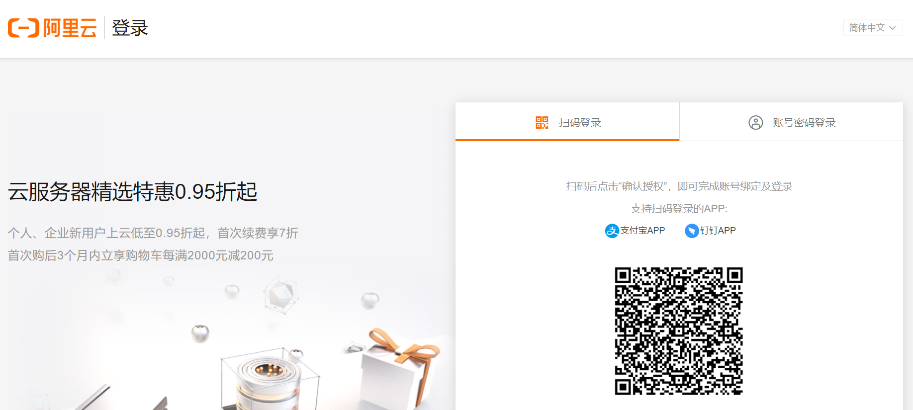

## 2. 进入阿里云控制台

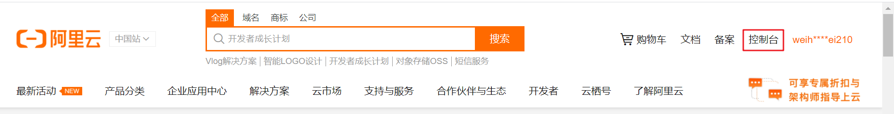


## 3.申请开头短信服务(秒开)

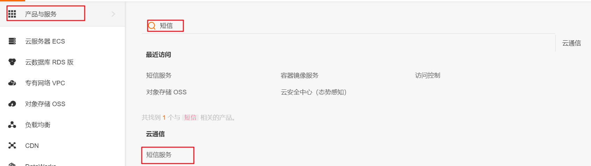


同时,充值5毛钱 备用 (也可以充值1毛,看经济实力,冲多了没用)

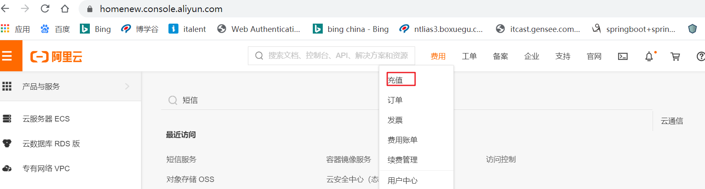

## 4.短信验签名申请

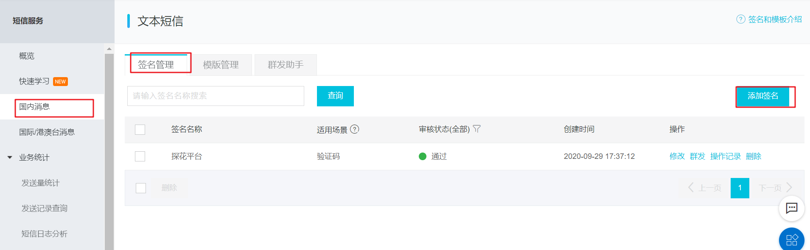


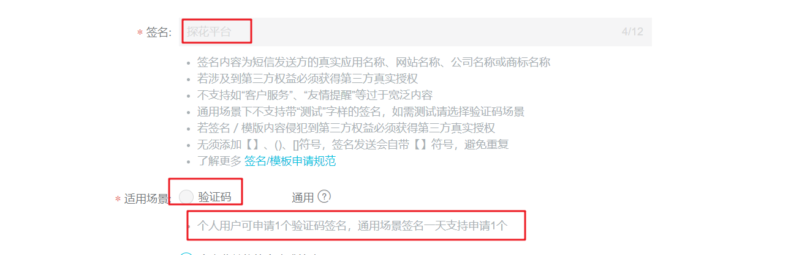


## 5. 短信模板申请

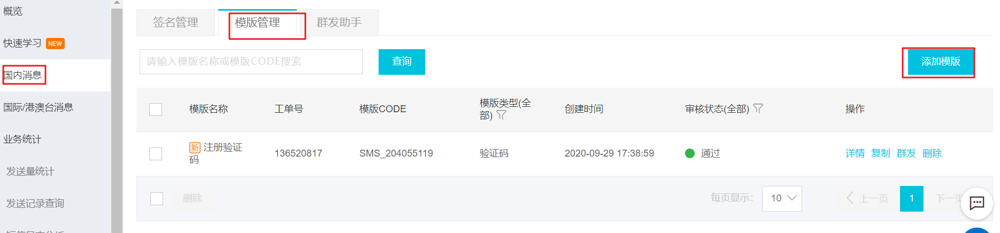

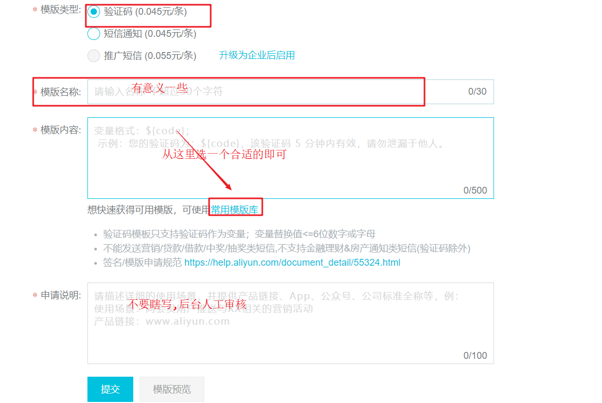


## 6生成秘钥及使用

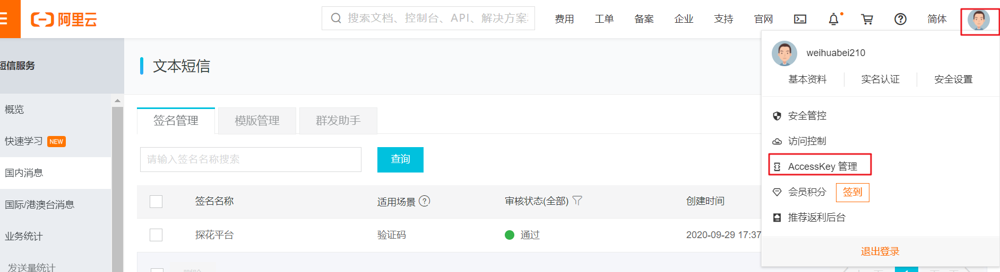

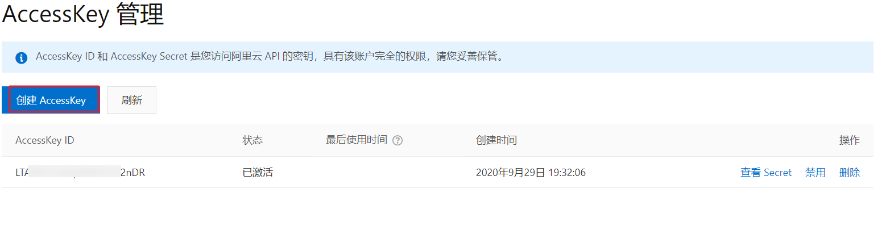

## 7, 发送短信

```java
package com.tanhua.sso;

import com.aliyuncs.CommonRequest;
import com.aliyuncs.CommonResponse;
import com.aliyuncs.DefaultAcsClient;
import com.aliyuncs.IAcsClient;
import com.aliyuncs.exceptions.ClientException;
import com.aliyuncs.exceptions.ServerException;
import com.aliyuncs.http.MethodType;
import com.aliyuncs.profile.DefaultProfile;
/*
pom.xml
<dependency>
  <groupId>com.aliyun</groupId>
  <artifactId>aliyun-java-sdk-core</artifactId>
  <version>4.5.3</version>
</dependency>
*/

public class SendSms {
    public static void main(String[] args) {
        DefaultProfile profile = DefaultProfile.getProfile("cn-hangzhou", "accessKeyId", "accessSecret");
        IAcsClient client = new DefaultAcsClient(profile);

        CommonRequest request = new CommonRequest();
        request.setSysMethod(MethodType.POST);
        request.setSysDomain("dysmsapi.aliyuncs.com");
        request.setSysVersion("2017-05-25");
        request.setSysAction("SendSms");
        request.putQueryParameter("RegionId", "cn-hangzhou");
        request.putQueryParameter("PhoneNumbers", "13288888888");
        request.putQueryParameter("SignName", "探花平台");
        request.putQueryParameter("TemplateCode", "SMS_204055119");
        request.putQueryParameter("TemplateParam", "{\"code\":\"123456\"}");
        try {
            CommonResponse response = client.getCommonResponse(request);
            System.out.println(response.getData());

        } catch (ServerException e) {
            e.printStackTrace();
        } catch (ClientException e) {
            e.printStackTrace();
        }
    }
}
```

## 8. 项目代码改造

SmsService.java

```java
public String sendSms(String mobile) {
        DefaultProfile profile = DefaultProfile.getProfile("cn-hangzhou", "<accessKeyId>", "<accessSecret>");
        IAcsClient client = new DefaultAcsClient(profile);

        CommonRequest request = new CommonRequest();
        request.setSysMethod(MethodType.POST);
        request.setSysDomain("dysmsapi.aliyuncs.com");
        request.setSysVersion("2017-05-25");
        request.setSysAction("SendSms");
        request.putQueryParameter("RegionId", "cn-hangzhou");
        request.putQueryParameter("PhoneNumbers", mobile);
        request.putQueryParameter("SignName", "探花平台");
        request.putQueryParameter("TemplateCode", "SMS_204055119");
        int code =RandomUtils.nextInt(100000, 999999);
        request.putQueryParameter("TemplateParam", "{\"code\":\"123456\"}");
        try {
            CommonResponse response = client.getCommonResponse(request);
            System.out.println(response);
            if(response.getData()!=null){
                Map<String,String> map = JSONObject.parseObject(response.getData(),Map.class);
                if(map.get("Code")!=null&&"OK".equalsIgnoreCase(map.get("Code"))){
                    return code+"";// 如果发送成功, 返回验证码
                }
            }
        } catch (ServerException e) {
            e.printStackTrace();
        } catch (ClientException e) {
            e.printStackTrace();
        }
        return null;

    }
```


# 2. 阿里云OOS

## 2.1 开通服务

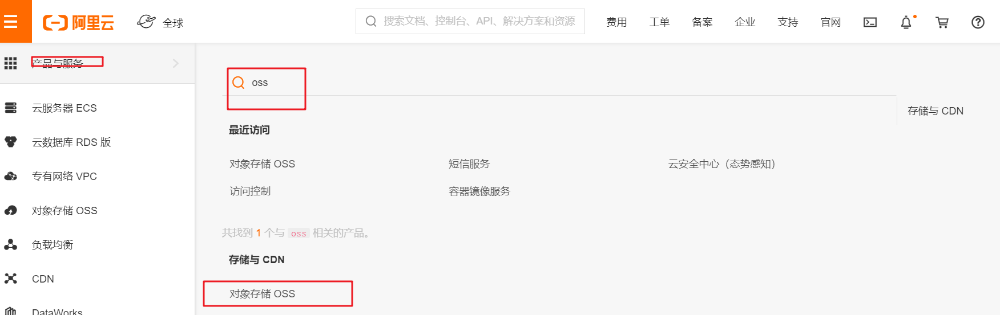

## 2.2 创建存储空间Bucket


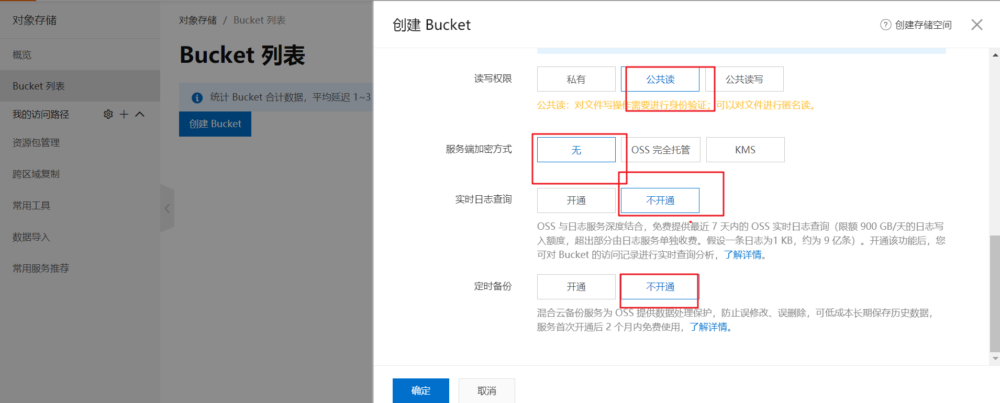


## 2.3 界面操作

可以在界面上操作删除,更改删除

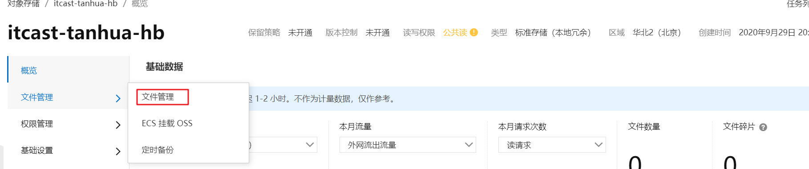

## 2.4 删除 Bucket

基础设置-- 最下方 删除当前bucket

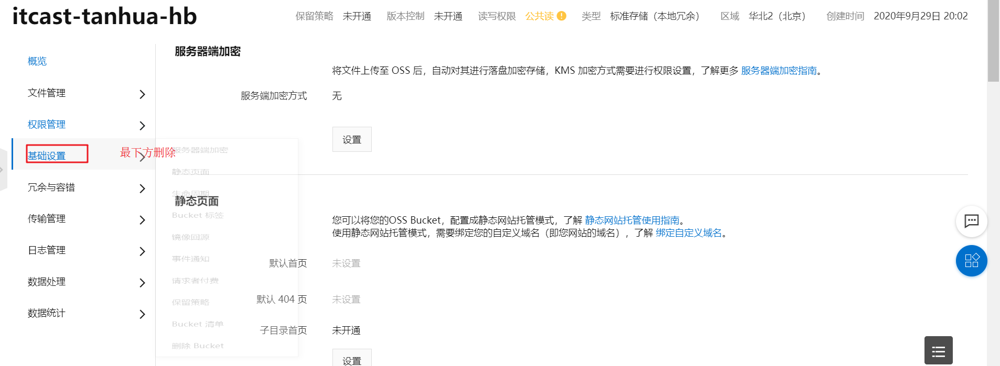

## 2.5 java 操作

https://help.aliyun.com/document_detail/32011.html?spm=a2c4g.11186623.4.1.4f806328oUkWcJ

```java
/**
     * 上传
     */
    @Test
    public void testupload() throws FileNotFoundException {
        OSSClient ossClient = new OSSClient("http://oss-cn-beijing.aliyuncs.com", "LTAI4G7n11111xasfsdfvcF2nDR", "zIsIdeLpUnI3xCasfasfd5ovR8Lt");

        ossClient.putObject("itcast-tanhua-hb", "image/2020/01/01/00.jpg", new File("D:\\arcsoft\\03.jpg"));
    }
    /**
     * 删除
     */
    @Test
    public void testdelete()  {
        OSSClient ossClient = new OSSClient("http://oss-cn-beijing.aliyuncs.com", "LTAI4G712312JEasfsadR", "zIsIdeLpUnI3xasdfasa5ovR8Lt");


        ossClient.deleteObject("itcast-tanhua", "image/2020/01/01/00.jpg");
    }

```

注意:

填写的参数要和自己的 bucket 地址一样  

