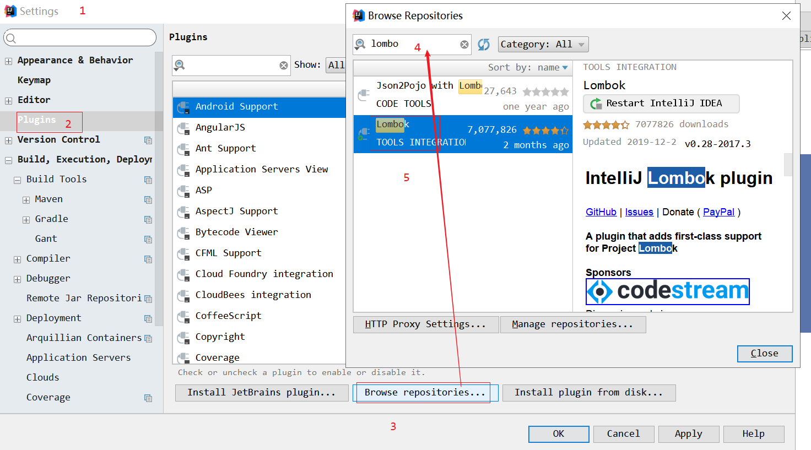

# 1, spring boot 日志功能

spring boot  整合webmvc 后 我们可以调整日志的输入级别

application.yml

```yaml
# spring boot  中输入日志
logging:
  level:
    #  com.itheima 的日志级别为 debug
    com.itheima: info
    #  org.springframework 的日志级别为 info
    org.springframework: info
```

UserController

```yaml
@RestController
public class UserController {

    Logger logger = LoggerFactory.getLogger(UserController.class);
    @RequestMapping("/hello")
    public String hello(){
        logger.debug("debug");
        logger.info("info");
        logger.warn("warn");
        return  "hello";
    }

}
```

# 2) lombok

项目中大量每个类都需要使用 对象, 同时我们的 pojo 类中需要 大量的固定的get,set,toString  方法

lombok 插件能够简化我们的代码 

使用方式

​	1) 首先安装idea 插件



2) 在项目中导入坐标

```xml
<dependency>
    <groupId>org.projectlombok</groupId>
    <artifactId>lombok</artifactId>
</dependency>
```

3) 使用

```
然后可以在Bean上使用：
    @Data ：自动提供getter和setter、hashCode、equals、toString等方法
    @Getter：自动提供getter方法
    @Setter：自动提供setter方法
    @Slf4j：自动在bean中提供log变量，其实用的是slf4j的日志功能。
```

```java
@RestController
@Slf4j
public class UserController {

   
    @RequestMapping("/hello")
    public String hello(){
        log.debug("debug");
        log.info("info");
        log.warn("warn");
        return  "hello";
    }

}
```

```java
@Data
public class User {   
    private int id;   
    private String username;    
    private String password;
}
```

```

```