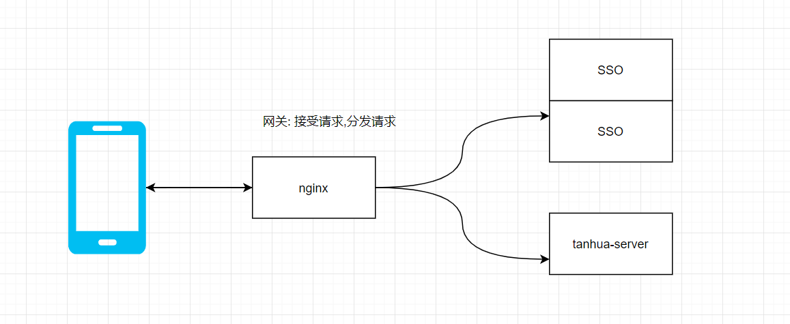
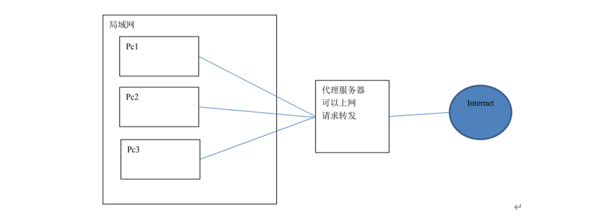
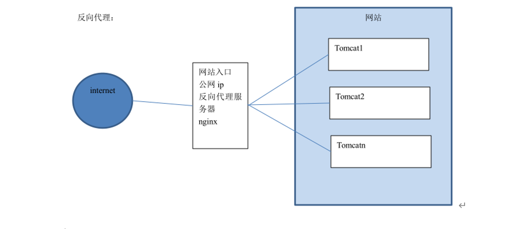
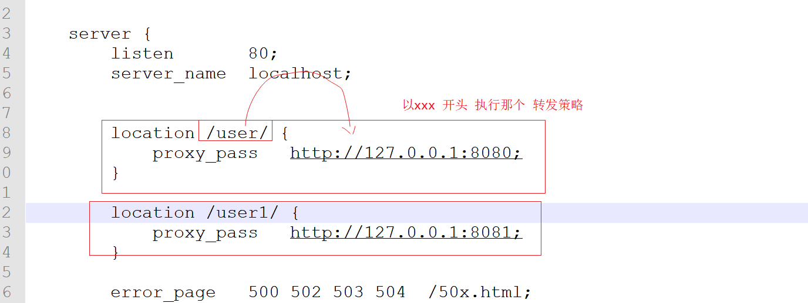

# Nginx反向代理与负载均衡

## 1 反向代理




### 1.1 什么是反向代理

反向代理（Reverse Proxy）方式是指以[代理服务器](http://baike.baidu.com/item/代理服务器)来接受internet上的连接请求，然后将请求转发给内部网络上的服务器，并将从服务器上得到的结果返回给internet上请求连接的客户端，此时代理服务器对外就表现为一个反向代理服务器。

首先我们先理解正向代理(例如VPN )，如下图：



​                               

正向代理是针对你的客户端，而反向代理是针对服务器的，如下图

 

 

 

### 1.2 配置反向代理-准备工作

（1） 启动spring-boot 项目 端口号8080

（2） 访问 localhost:8080 /hello 可以看到消息

### 4.1.3 配置反向代理

（1）在Nginx主机修改 Nginx配置文件

```properties
http {
    include       mime.types;
    default_type  application/octet-stream;
    sendfile        on;
    keepalive_timeout  65;
    server {
			listen       80;
			server_name  localhost;
			error_page   500 502 503 504  /50x.html;
			location = /50x.html {
				root   html;
			}
			location / {
				proxy_pass   http://127.0.0.1:8080;
			}
	}
	}
```

（2）重新启动Nginx 然后用浏览器测试：localhost 





## 2 负载均衡

### 2.1 什么是负载均衡

负载均衡 建立在现有网络结构之上，它提供了一种廉价有效透明的方法扩展[网络设备](http://baike.baidu.com/item/网络设备)和[服务器](http://baike.baidu.com/item/服务器)的带宽、增加[吞吐量](http://baike.baidu.com/item/吞吐量)、加强网络数据处理能力、提高网络的灵活性和可用性。

负载均衡，英文名称为Load Balance，其意思就是分摊到多个操作单元上进行执行，例如Web[服务器](http://baike.baidu.com/item/服务器)、[FTP服务器](http://baike.baidu.com/item/FTP服务器)、[企业](http://baike.baidu.com/item/企业)关键应用服务器和其它关键任务服务器等，从而共同完成工作任务。

### 2.2 配置负载均衡-准备工作

（1）将刚才的工程的 修改端口号 8081 .8082 分别 启动(同时启动3个应用)

（1）为了能够区分是访问哪个服务器的网站，可以在返回数据上加上端口号区分

### 4.2.3 配置负载均衡

修改 Nginx配置文件：

  ```properties
http {
    include       mime.types;
    default_type  application/octet-stream;

  
    sendfile        on;
    keepalive_timeout  65;
	
	
	upstream tanhua {
	   server localhost:8080;
	   server localhost:8081 ;
	   server localhost:8082;
    }
    server {
			listen       80;
			server_name  localhost;
			error_page   500 502 503 504  /50x.html;
			location = /50x.html {
				root   html;
			}
			
			location / {
				proxy_pass   http://tanhua;
			}
		}
}
  ```


地址栏输入localhost 刷新观察每个网页的标题，看是否不同。

经过测试，三台服务器出现的概率各为33.3333333%，交替显示。

如果其中一台服务器性能比较好，想让其承担更多的压力，可以设置权重。

比如想让NO.1出现次数是其它服务器的2倍，则修改配置如下：

  ````properties

http {
    include       mime.types;
    default_type  application/octet-stream;

  
    sendfile        on;
    keepalive_timeout  65;
	
	
	upstream tanhua {
	   server localhost:8080;
	   server localhost:8081 weight=2;
	   server localhost:8082;
    }
    server {
			listen       80;
			server_name  localhost;
			error_page   500 502 503 504  /50x.html;
			location = /50x.html {
				root   html;
			}
			
			location / {
				proxy_pass   http://tanhua;
			}
		}
}
  ````